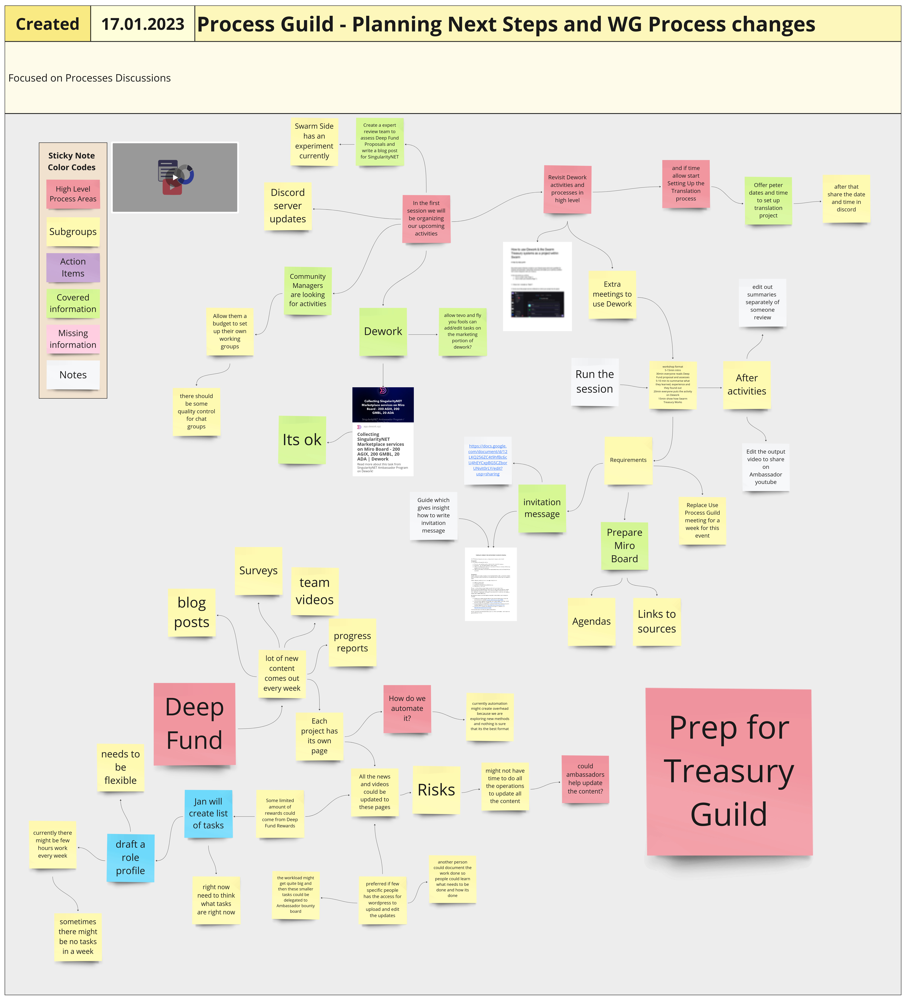

# Week 03

## Tuesday, 17th January 2023

### **Process Guild**

#### **Planning Next Steps and WG Process changes**

Hosted by Tevo Saks

#### Attendees: Jan, Tevo, Eric, Peter, David, cran dano

Process Guild - 17.01.2023 meeting overview



### **Process Guild - Planning Next Steps and WG Process changes**

Please check the whole concept at the Miro board link:

**Miro board:** [**https://miro.com/app/board/uXjVO0WVUBA=/**](https://miro.com/app/board/uXjVO0WVUBA=/)

<figure><figcaption></figcaption></figure>



<figure><figcaption></figcaption></figure>

### Please check the link how to use Dework & the Swarm Treasury systems...

How to use Dework & the Swarm Treasury systems as a project within Swarm



### Please check the link where you can check info about template format for invitations...

Template format for invitations to specific people



## Tuesday, 17th January 2023

### Ambassador Town Hall 30

Hosted by Tevo Saks

Ambassador Town Hall - 17.01.2023 meeting overview

There was no sound at the Ambassador Town Hall meeting, so Tevo did a quick review of what was happening at the meeting

#### Attendees: lain, Tevo, JulienCollins, Peter E, David, crandano, Felix(Swarm), Fly you fools, SucrenSpice, theholybinns



### You can view the agenda of Ambassador Town Hall meeting 30 at this link



### At the link below you can view the document in which the SingularityNET Ambassador Program rewards are presented



### You can also look at the link below SingularityNET Loyalty Rewards — Governance Event 



### Ambassador Town Hall 30&#x20;

Please check the whole concept at the Miro board link:

**Miro board:** [**https://miro.com/app/board/uXjVO0WVUBA=/**](https://miro.com/app/board/uXjVO0WVUBA=/)

## Wednesday, 18th January 2023

