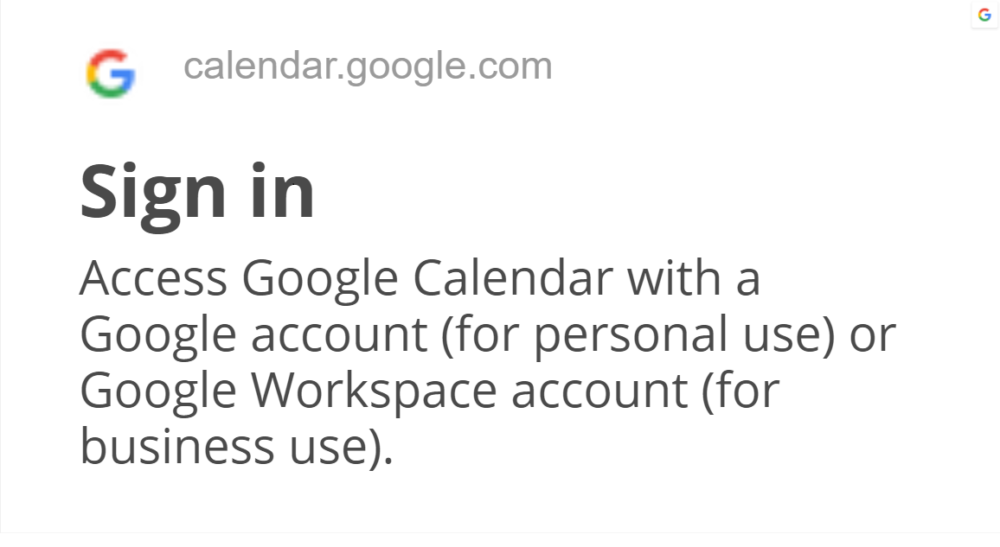
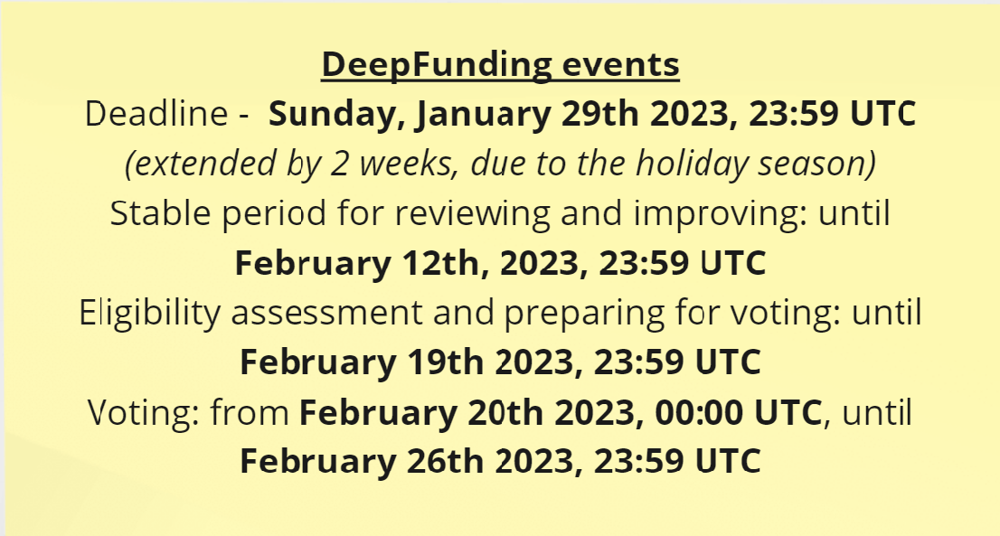

# Week 04

## Tuesday, 24th January 2023

### **Process Guild**

#### **Planning Next Steps and WG Process changes**

Hosted by Tevo Saks

#### Attendees: Tevo, Eric, Peter E, David, cran dano, Felix

Process Guild - the entire meeting from 24.01.2023. you can see on link below:



Through this Zoom meeting, the meetings of other groups within SingularityNET are defined

Marketing meeting: weekly fridays 13UTC

Miro board: [https://miro.com/app/board/uXjVO0WVUBA=/moveToWidget=3458764553099805901\&cot=10](https://miro.com/app/board/uXjVO0WVUBA=/?moveToWidget=3458764553099805901\&cot=10)

<figure><figcaption></figcaption></figure>

Marketing workshop: weekly thursdays 18UTC

[https://miro.com/app/board/uXjVO0WVUBA=/moveToWidget=3458764553099805901\&cot=10](https://miro.com/app/board/uXjVO0WVUBA=/?moveToWidget=3458764553099805901\&cot=10)

<figure><figcaption></figcaption></figure>

Podcast group  meeting: weekly monday 19UTC

[https://miro.com/app/board/uXjVO0WVUBA=/moveToWidget=3458764553099805901\&cot=10](https://miro.com/app/board/uXjVO0WVUBA=/?moveToWidget=3458764553099805901\&cot=10)

<figure><figcaption></figcaption></figure>

Treasury guild meeting: bi-weekly  thursdays 16UTC



Podcast: weekly mondays 17UTC



Town Hall weekly Tuesdays 18UTC&#x20;



A calendar has been created for all meetings on a weekly basis

<figure><figcaption></figcaption></figure>

#### Dates for DeepFunding events are presented

<figure><figcaption></figcaption></figure>

**Process Guild -  Planning Next Steps and WG Process changes**

Please check the whole concept at the Miro board link:

**Miro board:** [**https://miro.com/app/board/uXjVO0WVUBA=/**](https://miro.com/app/board/uXjVO0WVUBA=/)

###

### Ambassador Town Hall 31

Ambassador Town Hall - 24.01.2023 Agenda can find on this link



You can watch stories/interviews from the Singularity Podcast at the link:



Ambassador Town Hall 31

Please check the whole concept at the Miro board link:

**Miro board:** [**https://miro.com/app/board/uXjVO0WVUBA=/**](https://miro.com/app/board/uXjVO0WVUBA=/)

## Thursday, 26th January 2023

### Treasury Guild

Contribution and Distribution Discussions

Treasury Guild - 26.01.2023 meeting overview

Hosted by Tevo Saks

#### Attendees: Tevo, Cran , SucrenSpice



On the link belove you can check Marketing Guild Budgeting and supporting the structure document



On the meeting was presented a Survey for every 2 weeks about Agendas topics and you can check that on link:



Treasury Guild - Contribution and Distribution Discussions

Please check the whole concept at the Miro board link:

**Miro board:** [**https://miro.com/app/board/uXjVO0WVUBA=/**](https://miro.com/app/board/uXjVO0WVUBA=/)

## Saturday, 28th January 2023

### **Process Guild**

**Decision Making Structure**

On the link we can get information about Decision Making PBL Script



At this meeting, the concept of decision making structure is generally presented, which can be seen on the miro board link:

**Miro board:** [**https://miro.com/app/board/uXjVO0WVUBA=/**](https://miro.com/app/board/uXjVO0WVUBA=/)

####
