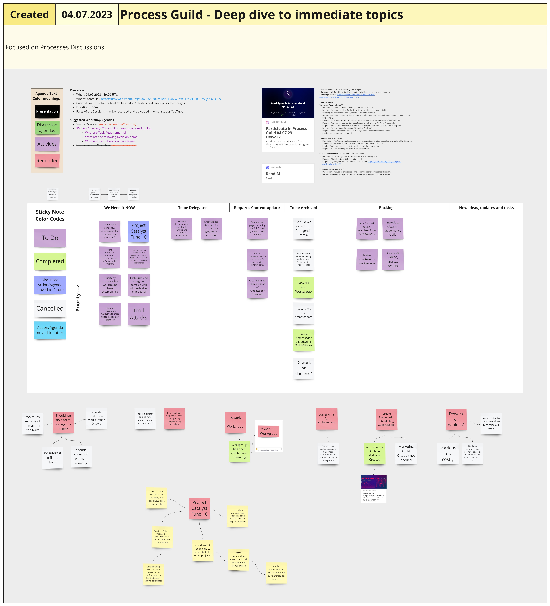
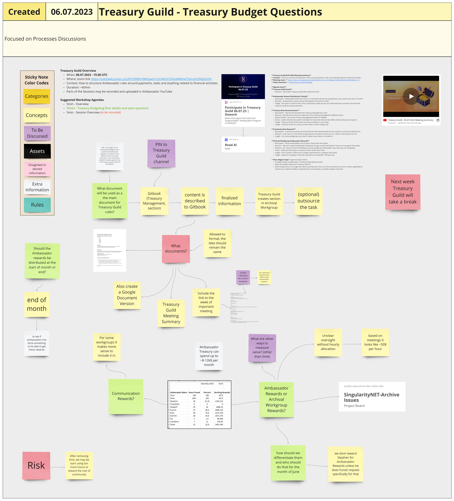

# Week 27



## Monday 3rd July 2023

### <mark style="color:green;">Education Guild</mark>

Not this week - holiday

***

## Tuesday 4th July 2023

### <mark style="color:green;">Governance WorkGroup</mark>

Not this week

***

### Ambassador Town Hall

No summary given

***

### <mark style="color:green;">Process Guild</mark>

#### **Context:**&#x20;

We prioritize critical Ambassador activities and cover process changes

#### **Meeting notes:**

&#x20;[https://miro.com/app/board/uXjVM7pbrUY=/?moveToWidget=3458764558152903760\&cot=10](https://miro.com/app/board/uXjVM7pbrUY=/?moveToWidget=3458764558152903760\&cot=10)&#x20;

<figure><figcaption>
Image of Miro board for this meeting
</figcaption></figure>


Hi-res PDF of Miro board for this meeting


#### **Agenda Items**&#x20;

#### **1) Archived Agenda Items**&#x20;

**Description -** There has been a list of agenda items we could archive \
**Decision -** Archived the idea of using form for agenda items in Process Guild\
**Learning -** Current agenda setting processes are more effective \
**Decision -** Archived the agenda item about a role which can help maintaining and updating Deep Funding Proposal page \
**Insight -** Task is outdated and Jan hasn't had time to provide updates about this opportunity \
**Decision -** Archived the agenda item about ideating on the use of NFTs for Ambassadors \
**Insight -** There has not been very few NFT use case experiments done in individual workgroups \
**Decision -** Archive comparing agenda "Dework or Daolens?" \
**Insight -** Dework is a more effective tool to recognize our work compared to DaoLens\
**Insight -** DaoLens costs 350$ /month&#x20;

#### **2) Dework PBL Workgroup**&#x20;

**Description -** This Workgroup focuses on creating educational project-based learning material for Dework on Andamio platform in collaboration with Gimbalabs and Governance Guild. \
**Insight -** Workgroup has been created and is successfully in operation \
**Insight -** 19.07.23 workshop we learn to set up localhost&#x20;

#### **3) Create Ambassador / Marketing Guild Gitbook**&#x20;

**Description -** Create a gitbook for Ambassadors or Marketing Guild \
**Decision -** Marketing Guild Gitbook not needed \
**Insight -** SingularityNET Archive Gitbook has most info [https://github.com/orgs/SingularityNET-Archive/discussions/7](https://github.com/orgs/SingularityNET-Archive/discussions/7)&#x20;

#### **4) Project Catalyst Fund 10**&#x20;

**Description -** Discussion of proposals and opportunities for Ambassador Program \
**Decision -** We keep the agenda item to later learn and align on proposal activities.

***

## Wednesday 5th July 2023

### <mark style="color:green;">Archives Workgroup</mark>



**Hosts** : Stephen Whitenstall&#x20;

**Date of Meeting** : Wednesday, 5th July 2023&#x20;

**Attendees** : Andre, Stephen, Tevo & Vanessa&#x20;

**Agenda** :&#x20;

1 - GitHub Project Board - Stephen&#x20;

2 - Practical Session - Vani

<mark style="color:green;">Meeting Issue</mark> &#x20;



<mark style="color:green;">Project Board</mark>



### <mark style="color:green;">Process Modelling Workgroup</mark>

#### **Context:**&#x20;

Establishing or maintaining processes to help community members to efficiently collaborate together.

#### **Meeting notes:**&#x20;

[https://miro.com/app/board/uXjVM7pbrQg=/?moveToWidget=3458764558174991866\&cot=10](https://miro.com/app/board/uXjVM7pbrQg=/?moveToWidget=3458764558174991866\&cot=10)&#x20;

<figure><figcaption>
Image of Miro board for this meeting
</figcaption></figure>

**Video Summary:**&#x20;



#### **Agenda Items**&#x20;

#### **1) Insights from MPW (Mini Proposal Workshop) templates**&#x20;

**Description -** Mini Proposal Workshops Templates are Catalyst Funded resources to help ideate on proposals on Miro Board; they consist of list of questions from different perspectives to make sure a proposal includes all necessary information \
**Insight -** We did not use any key elements brought out from MPW insights in this meeting.&#x20;

#### **2) Describe Workgroup Type Requirements**&#x20;

**Description** - Creating matrix table for workgroup types and their requirements\
**Decision -** New parameters for minimum requirements are (Evaluation & Agreement for Workgroup) \
**Action -** how do we repurpose existing workgroups which lose a lead and going through the metrics to complete it? \
**Insight -** Workgroup types don't yet feel correct, it almost looks like a process itself.

#### **3) Next elegant steps (general action items)**&#x20;

We continue hashing out matrix table.

***

### Incubation Workgroup and Strategy Guild

No summaries given

***

## Thursday 6th July 2023

### <mark style="color:green;">Onboarding Workgroup</mark>

Not this week

***

### <mark style="color:green;">Treasury Guild</mark>

#### **Context:**&#x20;

How to structure Ambassador rules around payments, tasks and anything related to financial activities.&#x20;

#### **Meeting notes:**&#x20;

[https://miro.com/app/board/uXjVM7pbrKE=/?moveToWidget=3458764558312867459\&cot=10](https://miro.com/app/board/uXjVM7pbrKE=/?moveToWidget=3458764558312867459\&cot=10)&#x20;

<figure><figcaption>
Image of Miro board for this meeting
</figcaption></figure>


Hi-res PDF of Miro board for this meeting


#### **Video Summary:**



#### **Agenda Items**&#x20;

#### **1) Treasury Guild break**&#x20;

**Decision** - Next week Treasury Guild takes collective break&#x20;

#### **2) Ambassador Reward Distribution Timing**&#x20;

**Description:** Ambassador Role from now on is rewarded without any expectations, we could do that start of month \
**Decision:** Ambassador rewards will be distributed at the end of month \
**Insight:** This gives us time to look at the contribution made and we can collectively block rewards if we think the rewards would be wasted otherwise

#### **3) Treasury Rule Documentation**&#x20;

**Description** - How do we document the Treasury Management rules? \
**Decision -** We will store most up-to-date info in the Treasury Management GitBook section Dework \
**Action -** Document Treasury Management Rules for GitBook \
**Action -** create "decision document" template for important decision that affect entire ambassador program \
**Insight -** Treasury Guild should make sure documentation is up to date \
**Insight -** Treasury Guild can outsource their tasks to other workgroups

#### **4) Communication Rewards**&#x20;

**Description -** In previous quarter we introduced the task that describes the time spent in social tools like Discord \
**Decision -** From now on, if you think it's appropriate and specific action you do, create a fund request for this \
**Insight -** For some workgroups and roles it makes more sense to include it in

#### **6) Archival Workgroup Ambassador Rewards**&#x20;

**Description -** Some ambassadors do not like to share their time spent \
**Decision -** We don't reward Ambassadors Rewards through normal distribution if we do not recognize time spent \
**Decision -** For month of June Fund Request can be created by Ambassadors whose time was not recognized \
**Action -** What are other ways to measure value? (other than time) \
**Insight -** From Quarter 3 there are no longer requirement to recognize time spent \
**Insight -** based on meetings it looks like members are rewarded \~50$ per hour

#### **7) Next elegant steps** (general action items)&#x20;

&#x20;\- Complete newly created tasks in Treasury Guild Dework board \
&#x20;\- Enjoy next weeks break from Treasury Guild :-)\
&#x20;\- Even though there is no longer the need to provide your time, we still recommend you to do so where applicable to enhance our collective ability to estimate time consumption on specific projects and tasks

***

### AI Sandbox

No summary given

***

### Deepfunding Town Hall

No summary given

***

## Friday 7th July 2023

### Video Workgroup

No summary given

***

### Writers' Workgroup

No summary given

***
