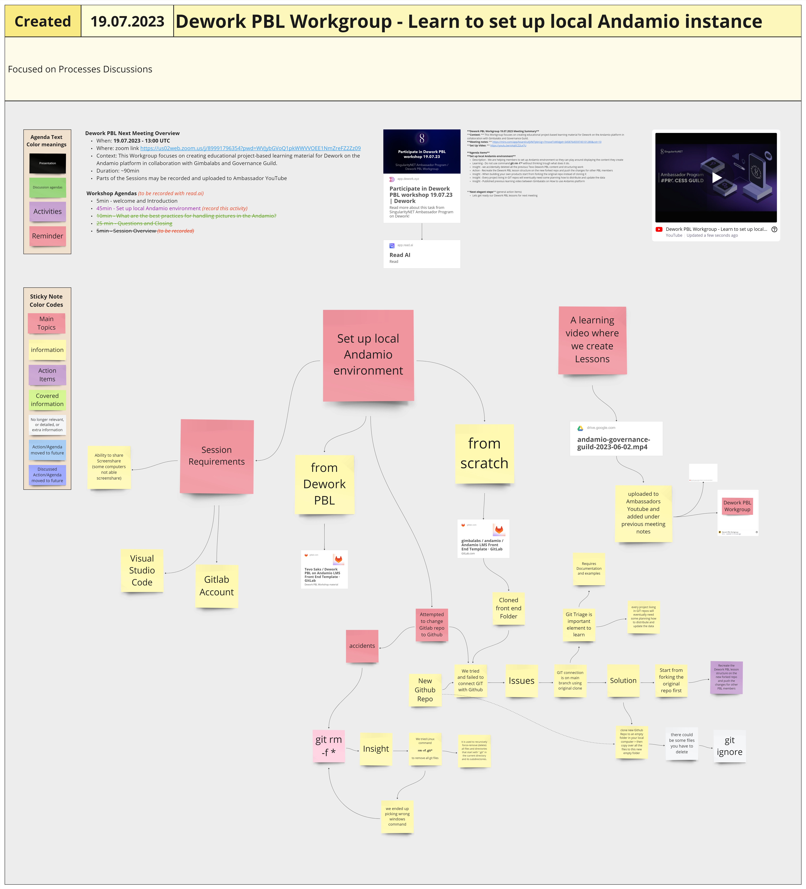

# Week 28

## Monday 10th July 2023 

### Education Guild

## Tuesday 11th July 2023

### Governance WorkGroup

### Ambassador Town Hall

### Process Guild

## Wednesday 12th July 2023

### <mark style="color:red;">Archives Workgroup</mark>

Not this week

***

### <mark style="color:red;">Dework PBL Workgroup</mark>

#### **Context:**&#x20;

This Workgroup focuses on creating educational project-based learning material for Dework on the Andamio platform in collaboration with Gimbalabs and Governance Guild.&#x20;

#### **Meeting notes:**&#x20;

[https://miro.com/app/board/uXjVM7pbrUg=/?moveToWidget=3458764559488684784\&cot=10](https://miro.com/app/board/uXjVM7pbrUg=/?moveToWidget=3458764559488684784\&cot=10)&#x20;

<figure><figcaption>
Image of Miro board for this meeting
</figcaption></figure>


Hi-res PDF of Miro board for this meeting


#### **Meeting Video Summary:**&#x20;



#### **Demonstration of Andamio platform navigation changes and workgroup role changes:**&#x20;



#### **Content upload demo:**&#x20;



#### **Agenda Items**&#x20;

#### **1) Demonstrate menu and category changes on the Andamio platform**

**Description -** Andamio platform has several opportunities to navigate between lessons and PBL modules \
**Insight -** presentation video: [https://youtu.be/GiCF6ikbchY](https://youtu.be/GiCF6ikbchY) \
**Learning -** There is currently missing an arrow button to jump from onboarding lessons into BBK lessons&#x20;

#### **2) Demonstrate Workgroup role changes**&#x20;

**Description -** We are trying to make it easier for others to get involved in the group \
**Insight -** presentation video: [https://youtu.be/GiCF6ikbchY?t=226](https://youtu.be/GiCF6ikbchY?t=226) \
**Decision -** Those who are active contributors in this workgroup get rewarded for participating in Dework PBL Workgroup \
**Decision -** Guest facilitators are rewarded 20$ per hour \
**Insight -** Due to Ambassador Program changes we don't need to keep track of the monthly budget and have room to do more work if the opportunity presents itself&#x20;

#### **3) Google Drive Repo for Pictures**&#x20;

**Description -** Temporary solution until we have our own image bank \
**Decision -** Google Drive link: [https://drive.google.com/drive/folders/1zaNZ1QFbYgZWP6HHGRmaJhV7u95XsIfl](https://drive.google.com/drive/folders/1zaNZ1QFbYgZWP6HHGRmaJhV7u95XsIfl) \
**Insight -** Use folders to make it later easier to find images \
**Insight -** also markdown files could be added here&#x20;

#### **4) Review Lessons**&#x20;

**Description -** We reviewed the lessons distributed 2 weeks ago \
**Action -** Upload draft markdown files to Andamio \
**Insight -** Most draft lessons will be broken into smaller lessons \
**Insight -** many nested links are required because the Dework platform has many features. \
**Insight -** we currently have 5 draft lessons with relevant information + How to create tasks + Describe account Overview use cases + How to Create Spaces + Templates + Basic principles expected to manage tasks Dework \
**Action -** Create Google Form to provide Feedback for the PBL Modules, [https://app.dework.xyz/singularitynet-ambas/dework-pbl-workgroup?taskId=c7b3b9c6-6457-431f-bff0-cb62b082467f](https://app.dework.xyz/singularitynet-ambas/dework-pbl-workgroup?taskId=c7b3b9c6-6457-431f-bff0-cb62b082467f) \
**Action -** Work on the lesson review feedback provided in today's meeting notes&#x20;

#### **5) Next elegant steps** (general action items)&#x20;

Next meeting on 19.07.23 we create Andamio Guides and get support to set up local instances.

***

### <mark style="color:red;">Process Modelling Workgroup</mark>

#### **Context:**&#x20;

Establishing or maintaining processes to help community members to efficiently collaborate together&#x20;

#### **Meeting notes:**

&#x20;[https://miro.com/app/board/uXjVM7pbrQg=/?moveToWidget=3458764558435769991\&cot=10](https://miro.com/app/board/uXjVM7pbrQg=/?moveToWidget=3458764558435769991\&cot=10)&#x20;

<figure><figcaption>
Image of Miro board for this meeting
</figcaption></figure>


Hi-res PDF of Miro board for this meeting


**Video Summary:**&#x20;



#### **Agenda Items**&#x20;

#### **1) Insights from Housekeeping**&#x20;

**Description -** We looked at the expectations for meeting prep and summary work \
**Insight -** We learnt that we can clarify expectations as we go.&#x20;

#### **2) Describe Workgroup Type Requirements**&#x20;

**Description -** Creating matrix table for workgroup types and their requirements\
**Decision -** Changed the names for workgroup types \
**Decision -** We added description columns for workgroup types and requirements \
**Action -** how do we repurpose existing workgroups which lose a lead and going through the metrics to complete it? \
**Insight -** Guilds might be separate from workgroups; we will revisit guilds when we are done adding content for workgroups.&#x20;

#### **3) Next elegant steps** (general action items)&#x20;

We continue hashing out matrix table.

***

### <mark style="color:red;">Incubation Workgroup and Strategy Guild</mark>

#### Host(s):&#x20;

Cran, Fly&#x20;

#### Attendees:&#x20;

cran, fly, headelf, felix, syntronyx, freys, sucren, eszter&#x20;

#### Agenda Items:&#x20;

Onboarding (Sucre), SWAE Proposal (Eszter), Incubation Proposal Ideation

#### **Length of Meeting:**&#x20;

2 hrs 15 min&#x20;

#### Goals and/or Action Items:&#x20;

* Onboarding WG will send out emails to remaining interested people in the program
* Incubation WG will work on a Fund Request / Proposal, field feedback for these topics&#x20;

**Summary:**&#x20;

**1) Onboarding:** email follow-up where some solutions were one-on-one outreach via Discord, more open and casual sessions (game night, informal meetups). Onboarding will work towards emailing remaining interested people. We discussed having at least one monthly scheduled meeting that's structured around onboarding. Onboarding meets bi-weekly, Thursdays @ 1pm UTC. Town Hall pre-party event is still 30min before Town Hall every Tuesday @ 6pm UTC&#x20;

**2) Eszter's Swae proposal** (Research project on organizational life-logging/organizational memory, which was initiated in a conversation with Eszter and David Orban) and began answering some of the questions: [https://proposals.deepfunding.ai/collaborate/03853891-57b6-454f-98c2-8242d48ebb3e](https://proposals.deepfunding.ai/collaborate/03853891-57b6-454f-98c2-8242d48ebb3e)&#x20;

**3) Fund requests / proposal for Incubation**. Conclusion is for work groups to just go ahead and experiment which we will work towards.&#x20;

4\) Eszter came in for the final hour. **Discussion on LLMs** mainly (Felix) and light discussion on Eszter's Swae proposal .

Miro (Team Link): [https://miro.com/app/board/uXjVMBZi88o=/?moveToWidget=3458764559289498274\&cot=14](https://miro.com/app/board/uXjVMBZi88o=/?moveToWidget=3458764559289498274\&cot=14)

***

## Thursday 13th July 2023

### <mark style="color:red;">Onboarding Workgroup</mark>

#### **HOST(S**):&#x20;

SucrenSpice&#x20;

#### **ATTENDEES**:&#x20;

SucrenSpice,Peter, Vani, Atmosphere&#x20;

#### **LENGTH OF MEETING**:&#x20;

1hr&#x20;

#### **AGENDA:**

* Intro and recap of last meeting
* Feedback from to-do items
* Onboarding - Problems and Solutions

#### **SUMMARY Progress Report:**

* Welcome video and How to use Dework video being done by the video workgroup are still in progress.
* SNET Ambassador Gitbook and the Getting started channel are also undergoing some updates.

**Onboarding Problems And Solutions**

* Several causes were raised on why new applicants were not seen participating in workgroups and meetings.
* Proffered solutions to these causes were equally given and are to be implemented in the coming days/weeks.

#### **Miro Board Link:**&#x20;

[https://miro.com/app/board/uXjVM5jyehQ=/?moveToWidget=3458764559340088151\&cot=14](https://miro.com/app/board/uXjVM5jyehQ=/?moveToWidget=3458764559340088151\&cot=14)&#x20;

#### **GOALS AND/OR ACTION ITEMS**

1. Follow-up emails and one-on-one outreach to individual applicants on Discord.
2. Invite new members to give feedback on the program.
3. Update the “getting started” Discord channel to show clarity on how to get involved.
4. Give roles on Discord after they show interest and participate.
5. Invite new members to join the Pre-Townhall meeting for games/quiz night.
6. Discuss starting a design/graphics workgroup in the next Ambassadors workgroup meeting.

***

### Treasury Guild

### AI Sandbox

### Deepfunding Town Hall

## Friday 14th July 2023

### Video Workgroup

### Writers' Workgroup
