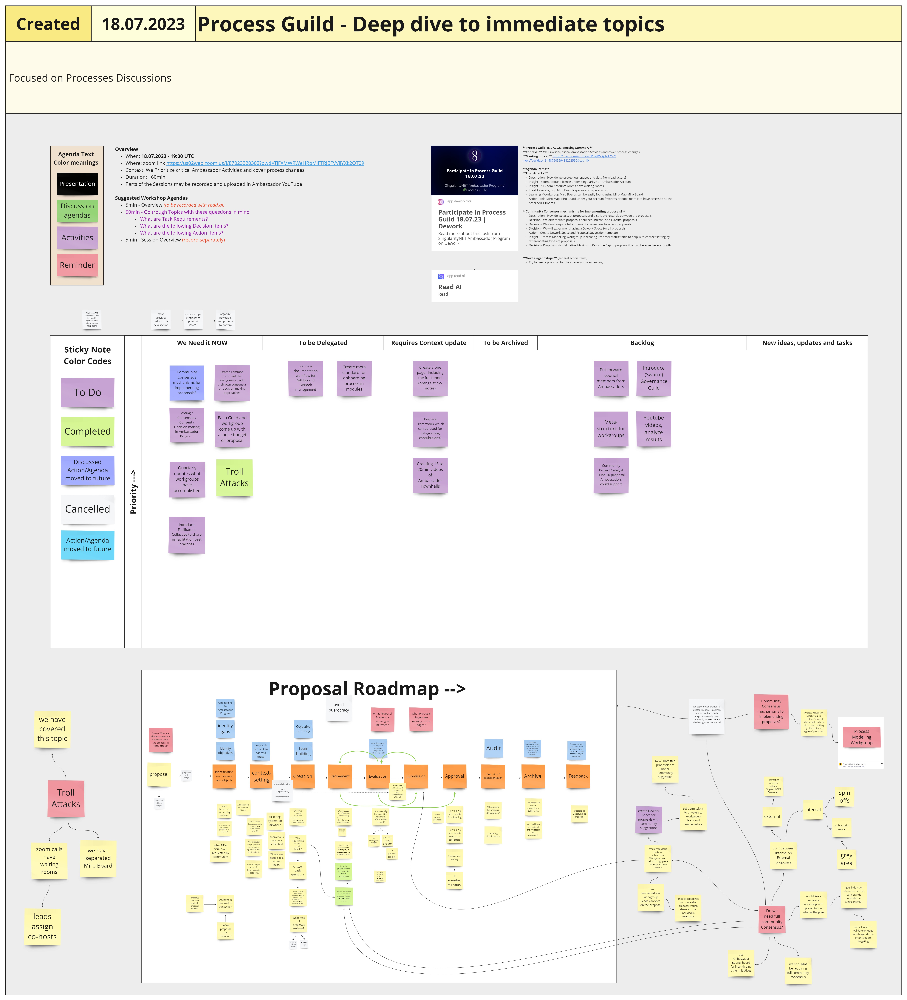
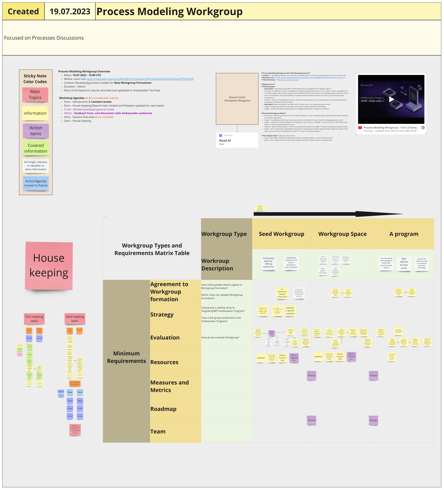

# Week 29

## Monday 17th July 2023 

### <mark style="color:red;">Education Guild</mark>

#### Attended by:

Peter, Syntronyx, and TheFreysDefi.

#### Summary:

The meeting opened up with Peter and Alex discussing the excellent work done by Alex on creating an education course using google apis.

Thefreysdefi joined and discussed his absence and reasoning. He also thanked the community for stepping up in his absence. Many thanks.

Alex created a short course – short in usage time, but lengthy in development – to begin what could end up turning into SingularityNet University. [https://storage.googleapis.com/alexsnyderselearningportfolio/SingularityNet/story.html](https://storage.googleapis.com/alexsnyderselearningportfolio/SingularityNet/story.html)

The discussion then turned to how to build out this concept into an ecosystem-wide initiative. This type of education format could be used to create learning modules for all ecosystem partners and projects. We also discussed using this method to help with onboarding users to the Snet marketplace both as consumers and creators.&#x20;

There was discussion on incentivitization for users after testing, but we hit a roadblock on how that would work as not to be gamified.&#x20;

Discussion went further into adoption of the Snet platfform by educational institutions and governments. This touched on The Department of Education and how to get in front of decision makers. We discussed the various departments, grant funding, and The Office of Technology Education that helps foster technology usage within education. This was a lengthy discussion

We went on to discuss how we would appropriately build out this initiative and what steps would need to be taken next. We settled on the need for a deepfunding proposal and discussed how it would be proper to proceed further, how funds should be appropriately used, and what is deemed proper for an ambassador guild funds request.

We agreed a project or creation of “something” would be needed to facilitate our goals. Peter recused himself from being a part of any deepfunding proposals as he is an employee. He did however support the idea. We also discussed involving other ambassadors.

It’s agreed further steps are needed to plan this out.&#x20;

***

## Tuesday 18th July 2023

### <mark style="color:red;">Governance WorkGroup</mark>

#### Meeting notes (slides) by Vanessa&#x20;

[https://docs.google.com/presentation/d/1D1D19Ej4Nhl-muZFzyDhtk9rI7oS33BzBDh8U90hbxg/edit#slide=id.p](https://docs.google.com/presentation/d/1D1D19Ej4Nhl-muZFzyDhtk9rI7oS33BzBDh8U90hbxg/edit#slide=id.p)



#### Additional notes ReadAI&#x20;

[https://app.read.ai/analytics/meetings/01H5MMPP35F1ZV4249N8NBCS1D?utm\_source=Share\_CopyLink](https://app.read.ai/analytics/meetings/01H5MMPP35F1ZV4249N8NBCS1D?utm\_source=Share\_CopyLink)&#x20;

#### Agenda Items:&#x20;

#### 1) What are the processes to record who is contributing to the Governance Framework doc?&#x20;

How can we improve the process? How should we display our problem (or other) statements? What platform?&#x20;

Don’t bring people to governance - take governance to people.Use the tools that people like and are familiar with.

What is our change process; how do we support continued evolution? Are we expecting fixed, finished documents that people can only read and not change? In this decentralised space maybe our governance documents need to be much more fluid - which would have a big effect on our governance, since most of us are used to the idea that “governance” does involve quite fixed things? &#x20;

**Decision:** on the Governance GitBook, we have listed key issues from the Governance Framework document, and a link to a Google Doc for each one where people can discuss and comment without needing to grapple with Git.

\
**ACTION:** We will post GitBook link in Discord [https://catalyst-swarm.gitbook.io/snet-ambassador-governance-framework/](https://catalyst-swarm.gitbook.io/snet-ambassador-governance-framework/), explain what we are inviting people to do, and ask people to contribute their thoughts via the linked Google docs

#### 2) Planning an event to discuss the most-commented issues in the Governance Framework doc

**ACTION:** Felix, Stephen, Slate, and Vani will get together to plan an event with breakouts to discuss the different topics in the Governance framework doc&#x20;

#### 3) Experimentation process in sNET, and recording a Governance baseline

See [https://docs.google.com/document/d/1pORhk41M5sSHn6drCxoynEaDgVK5ITfcCgEFpS1aBw0/edit?usp=sharing](https://docs.google.com/document/d/1pORhk41M5sSHn6drCxoynEaDgVK5ITfcCgEFpS1aBw0/edit?usp=sharing)

* Why are we building governance and who is it for? Is it a product?
* Language of governance for chains is often derived from public policy - idea of a “digital nation” - but reflecting on CIP-1694 shows that people use CORPORATE governance as a model.
* How do we frame change as an experiment? We need to be collecting experimental data on how well a change worked, i.e. ask stakeholders what effect it had on them. There’s also ethics around people’s informaed consent to be part of the “experiment”.
* Is “problem and solution” structure worth questioning too? It’s not an asset-based approach to focus on what is wrong - sometimes need to focus on what is good and how to amplify it. Also it falsely sugests that “problem and solution” are a matched pair, when actually there are many solutions to a problem, and which one you pursue can be political, or driven by resources, etc.

**ACTION:** Contact Eszter re: the “governance baseline” issues that we were discussing in the 16th June meeting.

#### Next steps:

We have done quite a lot of thinking and planning and structuring; we have the info on Gitbook and the associated Google docs…\
now, we need to focus on making sure people know about it and can join in.

***

### Ambassador Town Hall

No summary given

***

### <mark style="color:red;">Process Guild</mark>

#### **Context:**&#x20;

We Prioritize critical Ambassador activities and cover process changes&#x20;

#### **Meeting notes:**&#x20;

[https://miro.com/app/board/uXjVM7pbrUY=/?moveToWidget=3458764559488222590\&cot=10](https://miro.com/app/board/uXjVM7pbrUY=/?moveToWidget=3458764559488222590\&cot=10)&#x20;

<figure><figcaption>
Image of Miro board for this meeting
</figcaption></figure>


Hi-res PDF of Miro board for this meeting


#### **Agenda Items**&#x20;

#### **1) Troll Attacks**&#x20;

**Description -** How do we protect our spaces and data from bad actors? \
**Insight -** Zoom Account license under SingularityNET Ambassador Account \
**Insight -** All Zoom Accounts rooms have waiting rooms \
**Insight -** Workgroup Miro Boards spaces are separated into \
**Learning -** Workgroup Miro Boards can be easily found using Miro Map Miro Board \
**Action -** Add Miro Map Miro Board under your account favorites or bookmark it to have access to all the other SNET Boards&#x20;

#### **2) Community Consensus mechanisms for implementing proposals?**&#x20;

**Description -** How do we accept proposals and distribute rewards between the proposals?\
**Decision -** We differentiate proposals between Internal and External proposals \
**Decision -** We don't require full community consensus to accept proposals \
**Decision -** We will experiment having a Dework Space for all proposals \
**Action -** Create Dework Space and Proposal Suggestion template \
**Insight -** Process Modelling Workgroup is creating Proposal Matrix table to help with context setting by differentiating types of proposals \
**Decision -** Proposals should define Maximum Resource Cap to proposal that can be asked every month&#x20;

#### **3) Next elegant steps** (general action items)&#x20;

Try to create proposal for the spaces you are creating.

***

## Wednesday 19th July 2023

### <mark style="color:red;">Archives Workgroup</mark>

Not this week.

***

### <mark style="color:red;">Dework PBL Workgroup</mark>

#### **Context:**&#x20;

This Workgroup focuses on creating educational project-based learning material for Dework on the Andamio platform in collaboration with Gimbalabs and Governance Guild.&#x20;

#### **Meeting notes:**

&#x20;[https://miro.com/app/board/uXjVM7pbrUg=/?moveToWidget=3458764559745101280\&cot=10](https://miro.com/app/board/uXjVM7pbrUg=/?moveToWidget=3458764559745101280\&cot=10)&#x20;

<figure><figcaption>
Image of Miro board for this meeting
</figcaption></figure>

#### **Set-Up Video:**&#x20;



**Agenda Items**&#x20;

#### **1) Set up local Andamio environment**&#x20;

**Description -** We are helping members to set up the Andamio environment so they can play around with displaying the content they create.\
**Learning -** Do not use the command git rm -f \* without thinking through what it does. \
**Insight -** we accidentally deleted all the previous Tevo Dework PBL content and structuring work \
**Action -** Recreate the Dework PBL lesson structure on the new forked repo and push the changes for other PBL members \
**Insight -** When building your own products start by forking the original repo instead of cloning it \
**Insight -** Every project living in GIT repos will eventually need some planning on how to distribute and update the data. \
**Insight -** Published previous learning video between Gimbalabs on How to use the Andamio platform&#x20;

#### **2) Next elegant steps** (general action items)&#x20;

Let's get our Dework PBL lessons ready for next meeting.

***

### <mark style="color:red;">Process Modelling Workgroup</mark>

#### **Context:**&#x20;

Workgroup lifecycle: the processes of establishing or maintaining workgroups to serve the community

#### **Meeting notes:**&#x20;

[https://miro.com/app/board/uXjVM7pbrQg=/?moveToWidget=3458764559379811175\&cot=10](https://miro.com/app/board/uXjVM7pbrQg=/?moveToWidget=3458764559379811175\&cot=10)&#x20;

<figure><figcaption>
Image of Miro board for this meeting
</figcaption></figure>


Hi-res PDF of Miro board for this meeting


#### **Video Summary:**&#x20;



#### **Agenda Items**&#x20;

#### **1) Housekeeping**&#x20;

**Description -** Discussed practicalities of Miro-based task management for meeting rhythms \
**Learning -** it's difficult to do task management simply by making sticky notes in miro - layout makes a big difference in understanding. We continue trying to communicate direction and intuition for meeting-preppers that will result in clear responsibilities and understanding of needed meeting-related activities and how to do second-level task-management.\
**Decision -** Iterated "housekeeping" area to clarify "this-meeting" tasks vs "next-meeting" tasks, and handoffs between responsible contributors week to week. \
**Description:** when prospective members don't do their parts, our workgroup doesn't work \
**Insight -** prospective members can't gain active status except by actively contributing \
**Insight -** reinforced need for developing some engagement flow for prospective members&#x20;

#### **2) Reviewed Workgroup model**&#x20;

**Description -** We focused discussion on the Seed workgroup - how a workgroup gets started and becomes adopted to its larger organization \
**Insight -** a workgroup should have a purpose clearly connected to its org's mission/strategy/gaps/pain-points \
**Insight -** Important to have feedback on workgroups - esp. if there is a budget - so it can continue, refine itself, stop itself or continue separately from the org. \
**Decision -** Recommend periodic **check of purpose and impact and budget** based on Workgroup activity/results \
**Insight** - We're developing a lightweight framework for workgroup lifecycles, leaving things flexible for people to act with autonomy while connecting their intent to impact on org-level needs.&#x20;

#### **3) Next elegant steps** (general action items)&#x20;

**Action -** Next Week: evaluate workgroup & program strategy / formation elements - same as Seed Group?? \
**Action -** Next: adopting metrics and impact measurements for different types of workgroups.

***

### Incubation Workgroup

***

### <mark style="color:red;">Strategy Guild</mark>

#### In attendance :&#x20;

Peter, Fly, Crandano, Kenichi, Headelf&#x20;

#### Agenda Item(s):&#x20;

#### 1. Levels and names for members of the Ambassador Cadre

#### 2. Leadership function and roles aka The Round Table.&#x20;

We had an open mic type ideation and spitballing style discussion. We discussed the need for a bit of hierarchy in the Ambassador program vs none. It was discussed and recognized that many people start as lurkers and some remain. Fly brought up and discussions were aimed at current Ambassadors that lurk in meetings, listening or multitasking and not participating. It was discussed how Read.ai could be gamed. Future strategy sessions will discuss and ideate around **Fly's concept on the need for active participation**. Discussion was pivoted to the need for direct and transparent communication with the foundation in part to help develop SingComDao. This brought up the Round Table as a solution. Peter suggested the Round Table could be the original Ambassadors. Discussion revolved around shrinking it to as small as 5.&#x20;

Headelf pivoted the discussion to **Ambassador roles and names** stating that humans need to feel they belong. The discussion settled into a consensus of four roles with the following names (we believe better role names are needed); New-bee for post lurkers; Trusted for first level Ambassador after a yet-to-be-defined process.&#x20;

Discussion focused on **Dework Task Points** after looking at Gimbals and a new SNET Token due to a strong suggestion by Kenichi. The consensus was Dework TPs could only be earned and not purchased; Work Group Leads - a more involved Ambassador with more TPs; Ambassadors - the senior level and higher reputation with more TPs. An elevated leadership position for Ambassadors in the Round Table was discussed.&#x20;

**Onboarding** was a major problem and hurdle. An issue was brought up by Kenric in an earlier meeting due to an email he received. He was confused by the letter and thought he had been elevated to the Ambassador role. Sucre-n-Spice had sent approximately 7 of these emails out during the beginning of July. This ‘not managing expectations’ had major concern to the attendees. We discussed and came to the consensus that ALL future Ambassadors had to complete a formal request that would be reviewed - perhaps by the RT. Or initially by the current Ambassadors for simple majority consensus. This way there would be a process the applicant was involved with on a voluntary basis and we would gain some insight. We also discussed the need for a more formalized Onboarding into the Ambassador program. Crandano will initiate and head a formal new Ambassador onboarding process. This will be via the new FR process. Sucre should continue with in channel onboarding process and head of the WG. This will assist her with a formalization of the process and a mentoring by several ambassadors. The group decided to use Peter's Telegram group as an experiment with this new application and Onboarding process slated for the first week in September. There were other questions and discussions on a legal wrapper and need for legal advice about what the Ambassador program is legally.&#x20;

Another serious member concern was around **conflict between individuals**. Peter and Headelf expressed concern and apologies for not recognizing and talking about the issue(s). This was another reason for the need of a Round Table so any issues can be handled. No member of the Ambassadors should ever feel ignored, slighted, humiliated, bullied, harassed or made to feel less or unsafe. Our role as Ambassadors is to elevate, mentor and befriend our members and all of Snet and all of humanity. We need to be solid here and with each other so we can evolve Benevolent AGI. I \[Headelf] ask any one with an issue - whatever it is - to DM me or if the issue is with me DM Peter. Let us work out whatever the issue is. And, a reminder we do have a Tuesday Ambassador-only unrecorded Zoom each week so we can discuss private issues and concerns in a safe environment.&#x20;

#### Meeting duration:

1 hour 30 minutes.&#x20;

#### Decisions:&#x20;

1\. Four Ambassador levels. Names to be worked by the community. \
2\. Formalized application to apply for Ambassadorship. \
3\. Onboarding process to be formalized headed by Crandano. \
4\. Experiment process of system with onboarding Telegram group as Ambassadors. \
5\. Further exploration, discussion and understanding of developing the Round Table.

***

## Thursday 20th July 2023

### <mark style="color:red;">Onboarding Workgroup</mark>

Not this week.

***

### <mark style="color:red;">Treasury Guild</mark>

#### **Context:**&#x20;

How to structure Ambassador rules around payments, tasks and anything related to financial activities.

#### **Meeting notes:**&#x20;

[https://miro.com/app/board/uXjVM7pbrKE=/?moveToWidget=3458764559872563238\&cot=10](https://miro.com/app/board/uXjVM7pbrKE=/?moveToWidget=3458764559872563238\&cot=10)&#x20;

#### **Agenda Items**&#x20;

#### **1) Creating Treasury Documentation**&#x20;

**Description -** Creating a place where are going to store all Treasury Management-related documentation and information \
**Decision -** We will be using Ambassador GitBook for that \
**Action -** We will continue to add more relevant information, we did not cover all required elements \
**Insight -** [https://snet-ambassadors.gitbook.io/home/group-1/treasury-management](https://snet-ambassadors.gitbook.io/home/group-1/treasury-management) \
**Insight -** a lot of participants were present when we went through the rules and moved them to GitBook. There seems to be very little misunderstanding of what the rules mean. \
**Insight -** In this meeting, we created Budget Overview, Introduction to Fund Request and Auditing sections.&#x20;

#### **2) Next elegant steps** (general action items)&#x20;

Continue updating and wording Treasury Documentation.\
Does anybody want to help facilitate Treasury Guild sessions?

### AI Sandbox

### Deepfunding Town Hall

## Friday 21st July 2023

### Video Workgroup

### Writers' Workgroup
