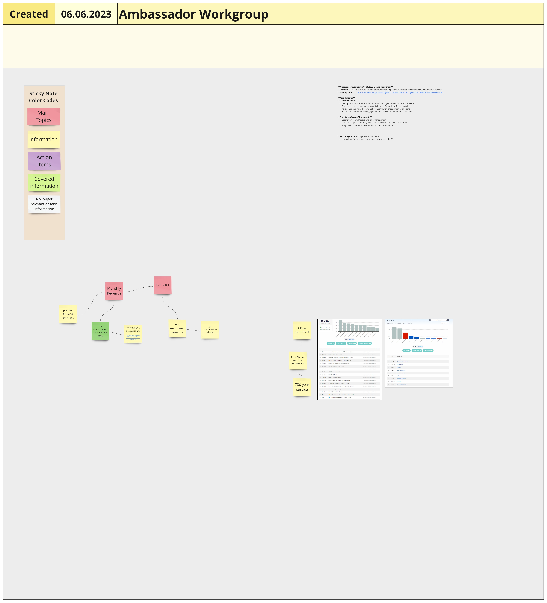
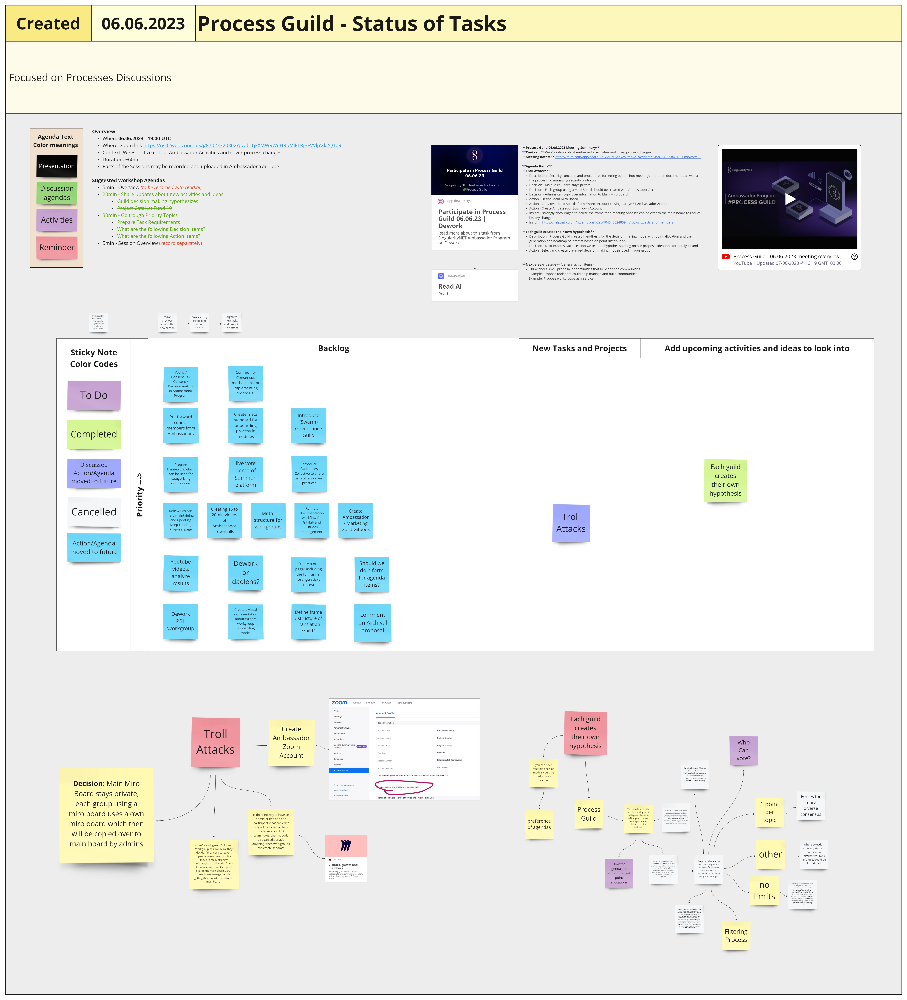
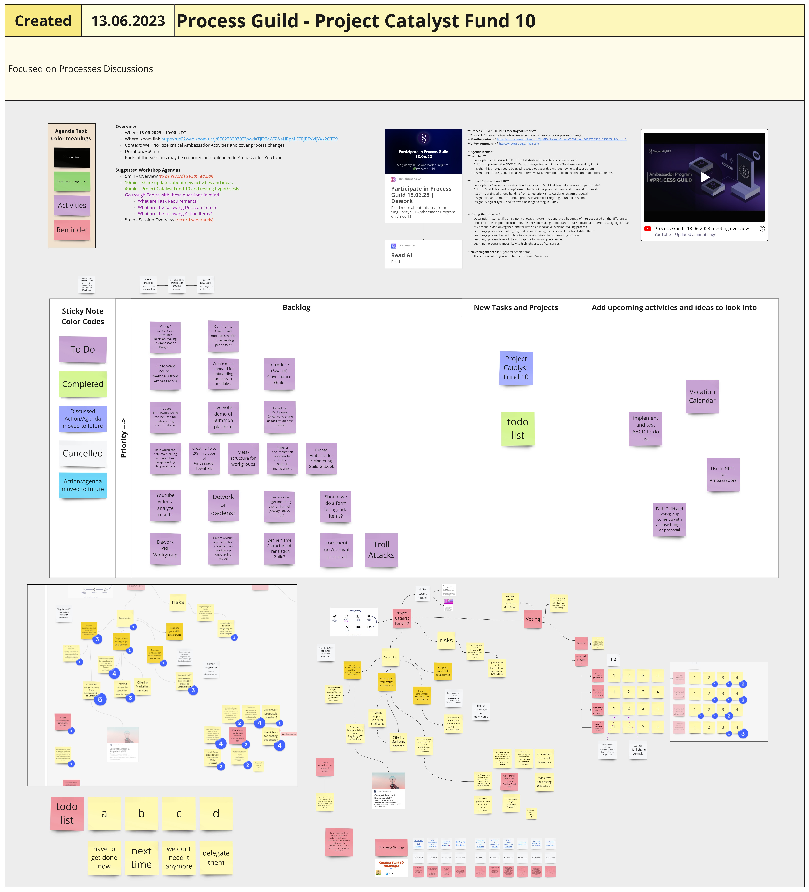
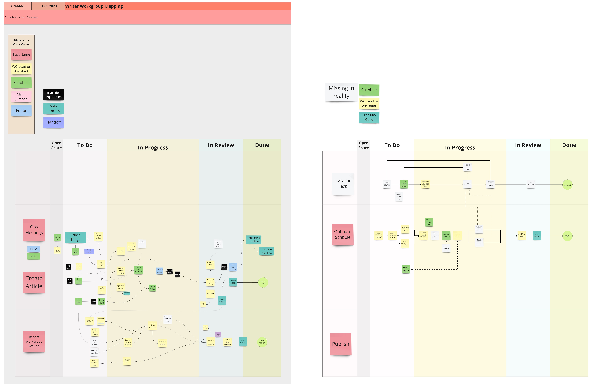
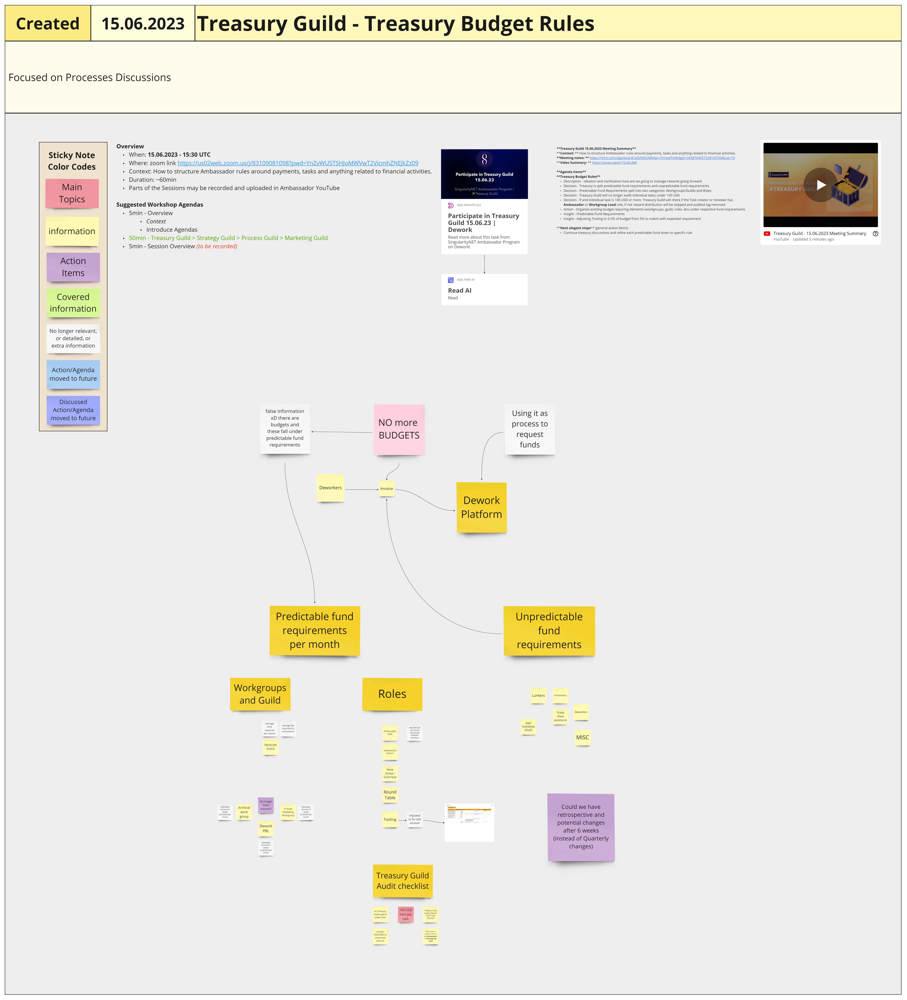

# Week 23

## Monday, 5th June 2023

### Education Guild

**Participants**: Slysyl, Ubiodee, Peter, Syntronyx, Rojo

**We did:** \
CIP-1694’s Workshop preparations. \
Alex is working on a demo to present later on. \
In the next town hall, we will have a Sophiaverse update. \
Open discussion.

## Tuesday, 6th June 2023

### Governance Workgroup

**Google Doc:** [link](https://docs.google.com/presentation/d/1fkMyoOAD3PjFsjWBiY4\_-iRyRONsS3HzoIY57hSTmts/edit?usp=sharing)\
**Google Slides with meeting notes:** [link](https://docs.google.com/presentation/d/1fkMyoOAD3PjFsjWBiY4\_-iRyRONsS3HzoIY57hSTmts/edit?usp=sharing)\
**Dework task:** [link](https://app.dework.xyz/singularitynet-ambas/gov-wg?taskId=809975d7-c4ce-468a-aafc-05ef9690d8ed)

We discussed the idea of facilitating peer education sessions focused on governance. Opinions differed on whether this fell within the purview of the Governance WG, with some arguing that the Education WG should handle such tasks. A counterpoint raised was the potential value of knowledge sharing on specific governance-related topics, which might encourage broader engagement.

The WG is open to the idea, but it remains unclear where such sessions would take place. Participants proposed various formats, including debates, info-sharing sessions, and others. The group agreed on creating a task to explore content selection and determine the format and venue of the sessions. This task will be open for a week for interested individuals to sign up.

Further we gave some updates on the initial Governance Framework document which is currently being cleaned up. As the cleaned up version still is a quite massive paper with over 20 pages, we discussed the option of setting up a process We could invite people to engage - NOT add new insights, but just mark the parts that they feel are not essential, and should be deleted. ( + Create a guide on how we’d like people to interact with this draft - i.e. if someone marks a passage for deletion and you agree, just comment that you agree )

#### Action items:

* A task will be created to explore the idea of peer education sessions, specifically around "ocracies".
* A second task will be created, focusing on identifying parts of the Governance Framework document that could be removed.
* To be further discussed: Individual Dework tasks will be created from the 11 “comments” issues in the Governance document. However, no agreement was reached on who will handle this task due to time constraints so we would still need to elaborate on the thing.

### Ambassadors' Workgroup

#### **Context:**&#x20;

How to structure Ambassador rules around payments, tasks and anything related to financial activities.&#x20;

[**Meeting notes**](https://miro.com/app/board/uXjVMDcNWXw=/?moveToWidget=3458764555900905549\&cot=10)

#### Miro


PDF of Miro board for Ambassadors Workgroup eeting, 6th June 2023


<figure><figcaption>
image of Miro board for Ambassadors' Workgroup 6th Jaune 2023
</figcaption></figure>

#### **Agenda Items:**&#x20;

#### **1) Monthly Rewards**&#x20;

**Description** - What are the rewards Ambassadors get this and months in forward?&#x20;

**Decision** - Lock in Ambassador rewards for next 2 months in Treasury Guild Action\
Connect with TheFreys Defi for Community engagement estimations&#x20;

**Action** - Create Community engagement tasks based on last month estimations&#x20;

#### **2) Tevo 9 days Screen Time results**&#x20;

Description - Tevo Discord and time management&#x20;

Decision - adjust community engagement according to scale of this result&#x20;

Insight - Good details for first impression and estimations&#x20;

#### **3) Next elegant steps** (general action items)&#x20;

Learn about Ambassadors "who wants to work on what?"

### Ambassadors Town Hall #51

Jon Grove attended to share about SophiaVerse (see presentation and whitepaper below)

<mark style="color:red;">**Action item:**</mark> tomorrow's incubation workshop will ideate on how we as ambassador program want to interact with SophiaVerse.&#x20;

**Short term** - spread awareness, connect with the Sophia ambassadors (potential workgroup?), promote the launch once more info is public, vote on daomaker: [https://daomaker.com/company/sophiaverse/o0O1KoaJlY](https://daomaker.com/company/sophiaverse/o0O1KoaJlY)&#x20;

**Mid term** - join in on the fun, teach Sophia about the ambassador program Further mid and long term to emerge as we go

Presentation on SophiaVerse by Jon Grove





### Process Guild

#### **Context:**

We prioritize critical Ambassador Activities and cover process changes.

#### **Meeting notes:**

[https://miro.com/app/board/uXjVMDcNWXw=/?moveToWidget=3458764555841405688\&cot=10](https://miro.com/app/board/uXjVMDcNWXw=/?moveToWidget=3458764555841405688\&cot=10)


PDF of Miro board for Process Guild 6th June 2023


<figure><figcaption>
hi-res image of Miro board for Process Guild meeting, 6th June 2023
</figcaption></figure>

**Agenda Items**&#x20;

**Troll Attacks** \
**Description** - Security concerns and procedures for letting people into meetings and open documents, as well as the process for managing security protocols.

**Decision** - Main Miro Board stays private \
**Decision** - Each group using a Miro Board should be created with Ambassador Account.\
**Decision** - Admins can copy over information to Main Miro Board&#x20;

**Action** - Define Main Miro Board \
**Action** - Copy over Miro Boards from Swarm Account to SingularityNET Ambassador Account \
**Action** - Create Ambassador Zoom own Account&#x20;

**Insight** - strongly encouraged to delete the frame for a meeting once it's copied over to the main board to reduce history changes \
**Insight** - [https://help.miro.com/hc/en-us/articles/7045408248594-Visitors-guests-and-members](https://help.miro.com/hc/en-us/articles/7045408248594-Visitors-guests-and-members)&#x20;

#### **Each guild creates their own hypothesis**&#x20;

**Description** - Process Guild created hypothesis for the decision-making model with point allocation and the generation of a heatmap of interest based on point distribution&#x20;

**Decision** - Next Process Guild session we test the hypothesis voting on our proposal ideations for Catalyst Fund 10&#x20;

**Action** - Select and create preferred decision making models used in your group.

#### **Next elegant steps** (general action items)&#x20;

Think about small proposal opportunities that benefit open communities.\
**Example:** Propose tools that could help manage and build communities\
**Example:** Propose workgroups as a service

## Wednesday, 7th June 2023

### Archive Workgroup



### Process Modelling WorkGroup

#### Meeting summary

**Context:** Establishing or maintaining processes to help community members to efficiently collaborate together&#x20;

**Meeting notes:** [https://miro.com/app/board/uXjVMDcNWXw=/?moveToWidget=3458764556412211150\&cot=10](https://miro.com/app/board/uXjVMDcNWXw=/?moveToWidget=3458764556412211150\&cot=10)&#x20;

**Video Summary:** [https://youtu.be/FpqPCyHQPQM](https://youtu.be/FpqPCyHQPQM)&#x20;

<figure><figcaption>
image of meeting Miro board
</figcaption></figure>



**Agenda Items:**

#### **Housekeeping**&#x20;

**Description** - Process Modelling Workgroup internal tasks\
**Decision** - Use Process Modelling Dework Task to recognize time it takes to model process Dework \
**Action** - Create and assign activities and task points to Process Modelling Dework Task (use template) \
**Action** - Create and add give role 'process design' to all contributors \
**Insight** - Slate signed up to become Process Modelling Workgroup facilitator&#x20;

#### **Presenting and updating writers workgroup processes**

<figure><figcaption>
Miro board of Writers Workgroup process mapping
</figcaption></figure>


PDF of Writers Workgroup process mapping on Miro board


**Description** - designing process map on the Task Lane Framework \
**Decision** - Miro Board processes will not be implemented on Dework, but instead used as reference Dework \
**Action** - Headelf will create 'Operations Meetings' task process on the Task Lane Framework \
**Dework Action** - Slate will create 'Publishing Material' task process on the Task Lane Framework \
**Insight** - Pair up for assistance is an overhead team may not be able to establish \
**Learning** - have a checklist for article reviewer Learning - have a separate checklist for publishers&#x20;

#### **Next elegant steps** (general action items)&#x20;

Finalize processes for demonstration.

### Strategy Guild

#### **Host:**&#x20;

Headelf&#x20;

#### **Attendees**:&#x20;

Peter, DeFrey, SucrenSpice, Felix, Vanessa, Rojo, SlySyl.&#x20;

#### **Agenda:**&#x20;

#### 1) Proposed 3rd quarter Budget and Ambassador Program framework change.&#x20;

Presentation made by Headelf on current status of Ambassador framework, compensation, accomplishments and reason(s) for this suggested change to framework and compensation structure.&#x20;

[Presentation Link](https://www.icloud.com/iclouddrive/08eTygk1-gRk-PsSdyDJ0Zmfw#Ambassador\_3rd\_quarter\_2023\_discussion)\
[Budget & Framework proposal link](https://docs.google.com/spreadsheets/d/1y6BMN\_1hOak8uhbFbi5EfId6IdDHORG4vwQpjVC4ewE/edit?usp=sharing)\
[Proposed budget as a Google sheet](https://docs.google.com/spreadsheets/d/1y6BMN\_1hOak8uhbFbi5EfId6IdDHORG4vwQpjVC4ewE/edit?usp=sharing)


Meeting notes as PDF


#### Discussion key points:&#x20;

**Peter:** good foundation for discussion; re: roundtable structure - …downside of constant voting - 6 month term seems a good length; liked large Misc budget to allow for proposals. Rojo: …Dework tasks and budget - how to do? Work Group leads - compensation?; …audit questions on Dework tasks - Alarm and audits one higher dollar amount - perhaps $100 USD cap on Dework. Re: new ambassadors - tokens for governance or task time.&#x20;

**Felix:** .. tokens for each WG for new ambassadors - build (“trust”) via tokens.&#x20;

**SlySyl:** Travel budget not needed.&#x20;

**Vani:** …Do we even need Roundtable elections?, … re rework - Price per task not hourly… real freelancers and gig work…Canvass ambassadors on changes proposed (re what next), What do we define “engagement”as?&#x20;

Sucren, Syl, Defrays had a number of typed comments in the zoom discussion. I could not capture them properly.&#x20;

#### Meeting length:&#x20;

approx 1 hour 10 minutes.

## Thursday, 8th June 2023

### Treasury Guild

#### **Context:**&#x20;

How to structure Ambassador rules around payments, tasks and anything related to financial activities.&#x20;

#### **Meeting notes:**

[https://miro.com/app/board/uXjVMDcNWXw=/?moveToWidget=3458764555508816842\&cot=10](https://miro.com/app/board/uXjVMDcNWXw=/?moveToWidget=3458764555508816842\&cot=10)&#x20;

<figure><figcaption>
meeting Miro board
</figcaption></figure>


PDF of meeting Miro board


**Agenda Items**&#x20;

#### **Monthly Ambassador Rewards**

**Description** - Planning expectations for reward allocation and distribution rules related to Ambassadors \
**Decision** - For the month of May and June 4273 AGIX will be rewarded to Ambassador roles \
**Action** - Treasury Guild will create new transaction to reimburse missing rewards to Ambassadors \
**Action** - Create a single source starting point to find latest information about Ambassador treasury and its allocations\
**Insight -** Starting from July Ambassadors might be allowed to be rewarded from Guild or Workgroup budgets \
**Insight -** Starting from July Ambassadors role may be changed and scoped down \
**Insight** - Starting from July a new role represented as current Ambassadors might be created \
**Insight** - Archival WG will revise budget projections for Q3 and request sign-off from Treasury Guild or Incubation (using data from Q2)&#x20;

#### **Using Contribution data as voting weight**&#x20;

**Description** - Shared mvp tool to capture votes from Miro Board and assign contribution data \
**Insight** - Tevo will continue adding more features to this tool in July \
**Insight** - there are lot of interesting voting systems and platforms to test \
**Action** - What are the advantages and disadvantages of different voting systems and platform options?&#x20;

#### **Sticky Note Color Codes**&#x20;

**Description** - A visual tool to help organize and find the information provided on Miro Boards \
**Decision** - new color added, dark blue "Discussed Action/Agenda Item moved to future" \
**Insight** - Color Code emerged from Process Guild where it became relevant to differentiate topics that need to be discussed in future and discussions already started&#x20;

#### **Retrospective rewards for Fly (David)**&#x20;

**Description** - Deciding Contribution rewards that were not rewarded by the time they were executed \
**Decision** - More clarity required how the previous retrospective rewards were calculated and if we should redo it for everyone\
**Decision** - License costs will be rewarded&#x20;

#### **Next elegant steps** (general action items)&#x20;

Think about Summer vacation

## Friday, 9th June 2023

### Writers Workgroup

Writers' Workgroup did not meet this week

### Video Workgroup

#### Facilitator:&#x20;

Rojo

#### Present:&#x20;

Rojo, Sucren, Agus, Lilycupcake, slysyl, Stephen, Vanessa

[Dework task for the meeting](https://app.dework.xyz/singularitynet-ambas/marketing-videos-94111?taskId=132a1c42-4d51-44e4-bd55-06201c42b49f)&#x20;

#### Meeting notes:

In this meeting we:

&#x20;\- Discussed how to use Summon and Crystal for proposal voting.\
&#x20;\- Discussed some of the issues with Summon, and planned to try Crystal this week.\
&#x20;\- Discussed making videos about Sophiaverse collaboratively.\
&#x20;\- Discussed Agus’ proposal to do social media management.\
&#x20;\- Mentioned Sucren’s script and planned to suggest it to members.

