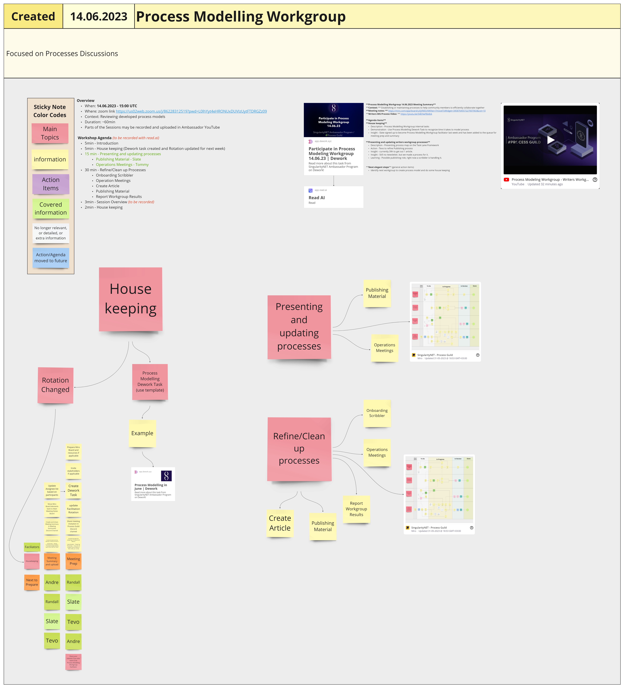

# Week 24



## Mon 12th June 2023

### Governance Workgroup Call: Experiment Framework Initiative

#### Present:

David Orban , Ester Galfalvi, Felix Weber

#### Recap:&#x20;

Call this morning where we dove into the issue of missing frameworks and processes for experimentation within the SingularityNET Ecosystem. It seems like our main challenges are related to coordination amongst ecosystem entities and participants. In addition, we're coming up short on community capacity to effectively operate experimental infrastructure. On top of that, securing financial resources to support framework operations and coordination is proving to be a bit of a challenge too.

We found some common ground during our discussion on several points:

Yes indeed, we're seeing a noticeable void in frameworks and processes for "experimentation at Snet" ^^ It's crucial that our experimentations are thoroughly documented and archived, making information readily accessible for all interested parties While it's important to have frameworks and standards, they shouldn't be forced upon anyone. Instead, they should act as guides for successful experimentation We're all for borrowing great ideas! Let's look at other ecosystems, both within and outside of the DLT world to discover already existing frameworks and processes for conducting experiments, and glean what we can Any efforts towards brainstorming and implementing frameworks should be viewed as a collaborative team effort amongst SingularityNET entities and participants

Next Steps We'll kick-start a "Problem Statement" document. The idea here is to clearly define our current issues and to pinpoint the critical questions that we need to address before we dive into solution mode.&#x20;

### Educational WorkGroup

This week's Educational WG meeting was replaced by a CIP-1694 community workshop; documentation coming soon.

## Tues 13th June 2023&#x20;

### Governance Workgroup

#### Host:&#x20;

Felix Weber&#x20;

#### Participants:&#x20;

@CallyFromAuron, @Stephen \[QADAO], @Kenric, @Peter E, @Slate&#x20;

#### Context:

Weekly Governance Workgroup call to discuss and align on previous and next steps.&#x20;

#### Notes/slides by @CallyFromAuron at:&#x20;


Slides containing notes from this meeting


#### Notes:

**1) Check-in** on previous tasks in the Dework space recognizing the yet low engagement from community members taking initiative on GovWG tasks. This evolved into a conversation about the lack of community capacity within the, as yet, fairly small singularitynet ecosystem (compared to larger DLT communities such as Cardano, Polkadot, Mina etc) Important takeaway from this part is that we recognized the need for collaboration on governance topics with other DLT ecosystems, which would allow us to take a more chain-agnostic approach and to scale up community governance capacity through collaboration.&#x20;

**2) Governance baselines** We discussed initiatives to start building some very first basic research on SingularityNET’s governance baselines. This underpins our emerging thinking on “experimental” approaches - without an understanding of the baselines (i.e. what we have now), we have nothing to compare with when we change something. So defining baselines would need to include both factual and qualitative info What are the elements of “governance” in general? What do we include when thinking about how sNet is governed? What is the "status quo" of governance at SingularityNET? How well is it working, and what effects is it having? Further, we work on a first Problem Statement on as-yet-missing frameworks and processes to conduct, document, measure and archive experiments within SNET.&#x20;

[https://docs.google.com/document/d/1pORhk41M5sSHn6drCxoynEaDgVK5ITfcCgEFpS1aBw0/edit#heading=h.9r9pscdc5qvk](https://docs.google.com/document/d/1pORhk41M5sSHn6drCxoynEaDgVK5ITfcCgEFpS1aBw0/edit#heading=h.9r9pscdc5qvk)&#x20;

A Pol.is survey aims to get additional insights and feedback: [https://pol.is/85b5cmb8cx](https://pol.is/85b5cmb8cx)&#x20;

**3) Ambassador Governance Framework Document** We briefly checked in on the cleaned up version of the Ambassador Governance Framework Document. Governance Framework - SingularityNET Ambassadors&#x20;

Ideas on next steps for the document include: \
Sending out the Document and ask community to mark the parts which could be deleted from the document for now, with the goal to get the document a bit smaller. \
Planning a public event to work on resolving the comments in the original doc. The top 4 or 5 issues (i.e. the ones with the most people commenting) would have its own breakout room, and one of us would facilitate discussion, using the “cluster” of comments on that issue as a starting point.&#x20;

**4) Action Items**

* Start research on the current governance at SingularityNET
* Start research on the best fits for later collaborations with other DLT ecosystems and communities
* Start planning an event to work on the comments in the Governance Framework document
* Work on the open tasks from last week

### Process Guild

#### **Context:**&#x20;

We prioritize critical Ambassador Activities and cover process changes

#### **Meeting notes:**

&#x20;[https://miro.com/app/board/uXjVMDcNWXw=/?moveToWidget=3458764556121566349\&cot=10](https://miro.com/app/board/uXjVMDcNWXw=/?moveToWidget=3458764556121566349\&cot=10)&#x20;

<figure><figcaption>
image of this meeting's Miro board
</figcaption></figure>


PDF of Miro board for this meeting


**Video Summary:**

&#x20;[https://youtu.be/gpATKFrcYRs](https://youtu.be/gpATKFrcYRs)&#x20;

#### **Agenda Items:**

#### **To-do list**&#x20;

**Description -** Introduce ABCD To-Do list strategy to sort topics on miro board \
**Action -** implement the ABCD To-Do list strategy for next Process Guild session and try it out \
**Insight -** this strategy could be used to weed out agendas without having to discuss them \
**Insight -** this strategy could be used to remove tasks from board by delegating them to different teams&#x20;

#### **Project Catalyst Fund 10**&#x20;

**Description -** Cardano innovation fund starts with 50mil ADA fund, do we want to participate? \
**Action -** Establish a workgroup/team to hash out the proposal ideas and potential proposals \
**Action -** Continued bridge-building from SingularityNET to Cardano (Swarm proposal) \
**Insight -** linear not multi-stranded proposals are most likely to get funded this time \
**Insight -** SingularityNET had its own Challenge Setting in Fund7&#x20;

#### **Voting Hypothesis**&#x20;

**Description -** we test if using a point allocation system to generate a heatmap of interest based on the differences and similarities in point distribution, the decision-making model can capture individual preferences, highlight areas of consensus and divergence, and facilitate a collaborative decision-making process. \
**Learning -** process did not highlighted areas of divergence very well nor highlighted them \
**Learning -** process helped to facilitate a collaborative decision-making process \
**Learning -** process is most likely to capture individual preferences \
**Learning -** process is most likely to highlight areas of consensus&#x20;

#### **Next elegant steps** (general action items)&#x20;

Think about when you want to have Summer vacation?

## Weds 14th June 2023

### **Dework PBL Workgroup**

#### **Context:**&#x20;

We focus on creating educational project-based learning material for Dework. One of the main platform being used for this project is Andamio.&#x20;

#### **Meeting notes:**

[https://miro.com/app/board/uXjVMDcNWXw=/?moveToWidget=3458764556413811937\&cot=10](https://miro.com/app/board/uXjVMDcNWXw=/?moveToWidget=3458764556413811937\&cot=10)&#x20;

<figure><figcaption>
Image of this meeting's Miro board
</figcaption></figure>


PDF of this meeting's Miro board


**Intro Video:**&#x20;

[https://youtu.be/B2t53mukhwo](https://youtu.be/B2t53mukhwo)&#x20;

#### **Agenda Items**&#x20;

**1) Workspace**&#x20;

**Description -** Development workspace to update website \
**Decision -** for the first updates will be using localhost to draft content to website \
**Action -** Update the website with markdown files before next workshop session \
**Insight -** Gimbalabs is working on Andamio architecture automation&#x20;

#### **2) Markdown Files**&#x20;

**Description -** Markdown is a lightweight markup language to add formatting elements to plaintext text documents.\
**Action -** Create Google Form to capture requirements expected we expect from markdown files that are uploaded to website\
**Action -** Include opportunity to opt in into workgroup activity in the Google Form \
**Insight -** [https://kenbod.github.io/markdown\_github\_01/basics.html](https://kenbod.github.io/markdown\_github\_01/basics.html)&#x20;

#### **3) PBL Development stages**&#x20;

**Description -** An estimated roadmap to develop one module of content to in an effective impactful way \
**Action -** Distribute module tasks asynchronously \
**Insight -** One module may take around 6 weeks from creation to completion with the workload of estimated 8 hours (does not include 3 meetings we use for review and feedback collection)&#x20;

#### **4) Menus and navigation?**&#x20;

**Description -** How do we want to organize our menus and navigation?\
**Insight -** After we have completed Dework PBL module we should look into how we want to navigate between the content that other workgroups in different communities create&#x20;

#### **5) Next elegant steps** (general action items)&#x20;

Tevo will work on newly created action items as a priority \
Next session will be held 28.06.2023 13:00 UTC (same link).

### **Process Modelling Workgroup**

#### **Context:**&#x20;

Establishing or maintaining processes to help community members to efficiently collaborate together&#x20;

#### **Meeting notes:**&#x20;

[https://miro.com/app/board/uXjVMDcNWXw=/?moveToWidget=3458764557227007063\&cot=10](https://miro.com/app/board/uXjVMDcNWXw=/?moveToWidget=3458764557227007063\&cot=10)&#x20;

<figure><figcaption>
Image of this meeting's Miro board
</figcaption></figure>


PDF of this meeting's Miro board


#### **Writers WG Process Video:**&#x20;

[https://youtu.be/54EHwFBx8zk](https://youtu.be/54EHwFBx8zk)&#x20;

#### **Agenda Items**&#x20;

#### **1) Housekeeping**&#x20;

**Description -** Process Modelling Workgroup internal tasks \
**Demonstration -** Use Process Modelling Dework Task to recognize time it takes to model process \
**Insight -** Slate signed up to become Process Modelling Workgroup facilitator last week and has been added to the queue for meeting prep and summary&#x20;

#### **2) Presenting and updating writers workgroup processes**&#x20;

**Description -** Presenting process map on the Task Lane Framework \
**Action -** Tevo to refine Publishing process \
**Insight -** currently 39h to get out 1 article. \
**Insight -** Still no newsletter, but we made a process for it. \
**Learning -** Possible publishing role, right now a scribbler is handling it.&#x20;

#### **3) Next elegant steps** (general action items)&#x20;

Identify next workgroup to create process model and do some housekeeping.

### Incubation Workgroup & Strategy Guild

#### Host(s):&#x20;

Cran, Headelf

**Attendees:**&#x20;

cran, sucrenspice, rojo, slysyl, headelf, stephen, felix, slate

#### Agenda Items:&#x20;

Ideating on minimum requirements to be an Ambassador and the Q3 Budget.

#### Length of Meeting:&#x20;

2 hrs

<figure><figcaption>
Image of the proposed new budget
</figcaption></figure>

<figure><figcaption></figcaption></figure>

 

<figure><figcaption></figcaption></figure>

 

<figure><figcaption></figcaption></figure>

 

<figure><figcaption>
Images from this meeting's Miro board
</figcaption></figure>

#### Goal and or Action Items:&#x20;

Requirements to be an Ambassador and Q3 Budget ideation require more hashing out in next week's meeting

#### Summary:&#x20;

We started the meeting ideating on minimum requirements to become an Ambassador. Ideas were brought up like creating a SNET Ambassador Token similar to the function of Gimbals that represents contribution, and having a minimum threshold. The conversation on this topic throughout the meeting was brought up a few times. Should there be other roles besides Ambassadors? What if someone wants to just contribute content creation and doesn't want to mentor, attend events, or represent the community?

We then dived into the Q3 Budget and broke it into sections. Each section had Pros, Cons, Thoughts & Ideas.

Certain parts of the budget, like Round Table, Mentors, and Show Assistance, could be looped back into the Ambassador and Task percentages.

## Thurs 15th June 2023&#x20;

### Treasury Guild

#### **Context:**&#x20;

How to structure Ambassador rules around payments, tasks and anything related to financial activities.&#x20;

#### **Meeting notes:**&#x20;

[https://miro.com/app/board/uXjVMDcNWXw=/?moveToWidget=3458764557228104766\&cot=10](https://miro.com/app/board/uXjVMDcNWXw=/?moveToWidget=3458764557228104766\&cot=10)&#x20;

<figure><figcaption>
image of Miro board for this meeting
</figcaption></figure>


PDF of Miro board for this meeting


#### **Video Summary:**&#x20;

[https://youtu.be/eI17jUELd6E](https://youtu.be/eI17jUELd6E)&#x20;

#### **Agenda Items**&#x20;

**1) Treasury Budget Rules**&#x20;

**Description -** Ideation and clarification how are we going to manage rewards going forward \
**Decision -** Treasury is split predictable fund requirements and unpredictable fund requirements \
**Decision -** Predictable Fund Requirements split into two categories: Workgroups/Guilds and Roles \
**Decision -** Treasury Guild will no longer audit individual tasks under 100 USD \
**Decision -** If an individual task is 100 USD or more, Treasury Guild will check if the Task creator or reviewer has Ambassador or Workgroup Lead role; if not, reward distribution will be skipped and audited tag removed.\
**Action -** Organize existing budget requiring elements (workgroups, guild, roles, etc) under respective fund requirements \
**Insight -** Predictable Fund Requirements \
**Insight -** Adjusting Tooling to 0.5% of budget from 5% to match with expected requirement&#x20;

#### **2) Next elegant steps** (general action items)&#x20;

Continue treasury discussions and refine each predictable fund down to specific rule

***

## Fri 16th June 2023

### Video WorkGroup

No summary given

***

### Writers' WorkGroup

No summary given

***
