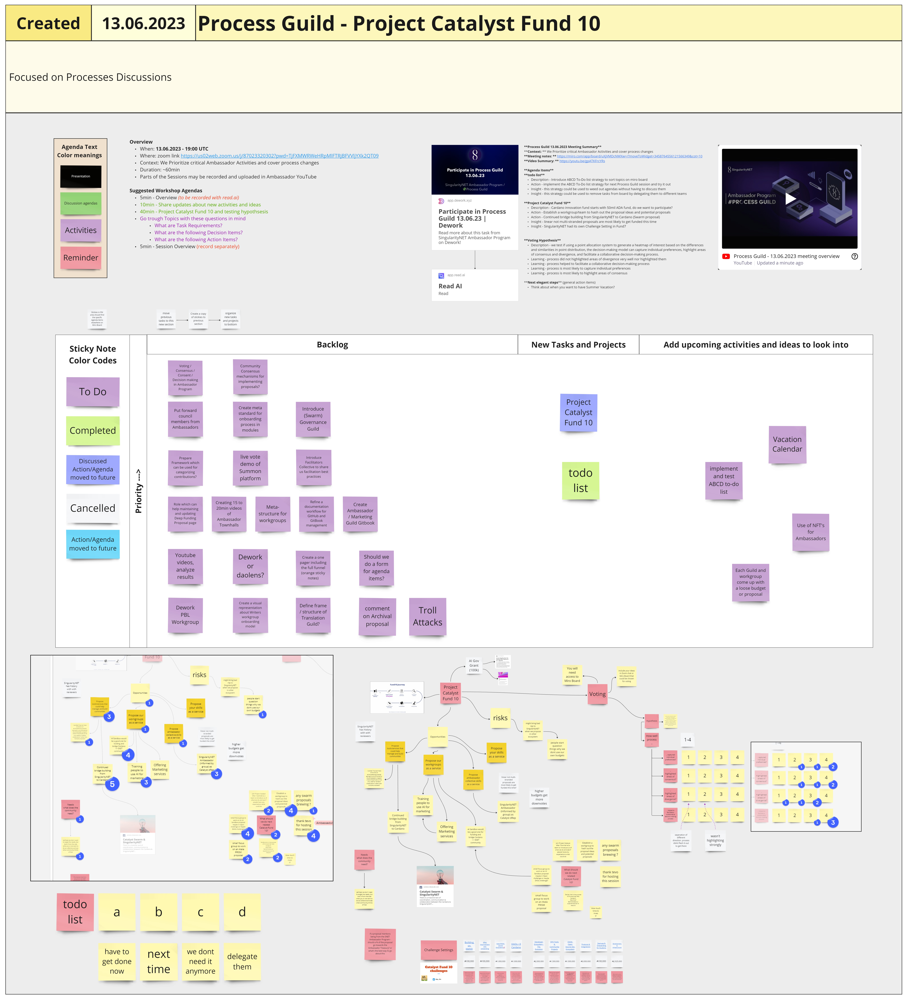

# Week 24

## Mon 12th June 2023

### Governance Workgroup Call: Experiment Framework Initiative

#### Present:

David Orban , Ester Galfalvi, Felix Weber

#### Recap:&#x20;

Call this morning where we dove into the issue of missing frameworks and processes for experimentation within the SingularityNET Ecosystem. It seems like our main challenges are related to coordination amongst ecosystem entities and participants. In addition, we're coming up short on community capacity to effectively operate experimental infrastructure. On top of that, securing financial resources to support framework operations and coordination is proving to be a bit of a challenge too.

We found some common ground during our discussion on several points:

Yes indeed, we're seeing a noticeable void in frameworks and processes for "experimentation at Snet" ^^ It's crucial that our experimentations are thoroughly documented and archived, making information readily accessible for all interested parties While it's important to have frameworks and standards, they shouldn't be forced upon anyone. Instead, they should act as guides for successful experimentation We're all for borrowing great ideas! Let's look at other ecosystems, both within and outside of the DLT world to discover already existing frameworks and processes for conducting experiments, and glean what we can Any efforts towards brainstorming and implementing frameworks should be viewed as a collaborative team effort amongst SingularityNET entities and participants

Next Steps We'll kick-start a "Problem Statement" document. The idea here is to clearly define our current issues and to pinpoint the critical questions that we need to address before we dive into solution mode.&#x20;

### Educational WorkGroup

This week's Educational WG meeting was replaced by a CIP-1694 community workshop; documentation coming soon.

## Tues 13th June 2023&#x20;

### Process Guild

#### **Context:**&#x20;

We prioritize critical Ambassador Activities and cover process changes

#### **Meeting notes:**

&#x20;[https://miro.com/app/board/uXjVMDcNWXw=/?moveToWidget=3458764556121566349\&cot=10](https://miro.com/app/board/uXjVMDcNWXw=/?moveToWidget=3458764556121566349\&cot=10)&#x20;

<figure><figcaption>
image of this meeting's Miro board
</figcaption></figure>


PDF of Miro board for this meeting


**Video Summary:**

&#x20;[https://youtu.be/gpATKFrcYRs](https://youtu.be/gpATKFrcYRs)&#x20;

#### **Agenda Items:**

#### **To-do list**&#x20;

**Description -** Introduce ABCD To-Do list strategy to sort topics on miro board \
**Action -** implement the ABCD To-Do list strategy for next Process Guild session and try it out \
**Insight -** this strategy could be used to weed out agendas without having to discuss them \
**Insight -** this strategy could be used to remove tasks from board by delegating them to different teams&#x20;

#### **Project Catalyst Fund 10**&#x20;

**Description -** Cardano innovation fund starts with 50mil ADA fund, do we want to participate? \
**Action -** Establish a workgroup/team to hash out the proposal ideas and potential proposals \
**Action -** Continued bridge-building from SingularityNET to Cardano (Swarm proposal) \
**Insight -** linear not multi-stranded proposals are most likely to get funded this time \
**Insight -** SingularityNET had its own Challenge Setting in Fund7&#x20;

#### **Voting Hypothesis**&#x20;

**Description -** we test if using a point allocation system to generate a heatmap of interest based on the differences and similarities in point distribution, the decision-making model can capture individual preferences, highlight areas of consensus and divergence, and facilitate a collaborative decision-making process. \
**Learning -** process did not highlighted areas of divergence very well nor highlighted them \
**Learning -** process helped to facilitate a collaborative decision-making process \
**Learning -** process is most likely to capture individual preferences \
**Learning -** process is most likely to highlight areas of consensus&#x20;

#### **Next elegant steps** (general action items)&#x20;

Think about when you want to have Summer vacation?

## Weds 14th June 2023&#x20;

## Thurs 15th June 2023&#x20;

## Fri 16th June 2023
