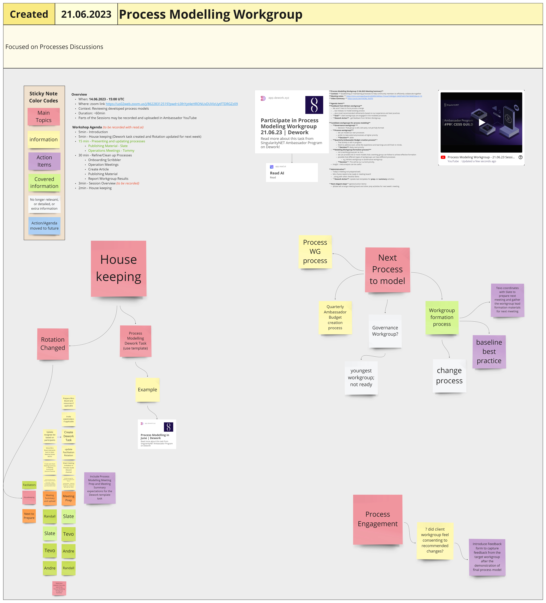

# Week 25



##

## Monday, 19th June 2023

***

### Education Guild

## Tuesday, 20th June 2023

### Governance Workgroup

This week's meeting was small and informal, so it was not recorded

### Ambassador Town Hall

Coming soon

### Process Guild

**Context:**

We Prioritize critical Ambassador Activities and cover process changes

#### **Meeting notes:**

[https://miro.com/app/board/uXjVMDcNWXw=/?moveToWidget=3458764557832254244\&cot=10](https://miro.com/app/board/uXjVMDcNWXw=/?moveToWidget=3458764557832254244\&cot=10)

<figure><figcaption>
Image of Miro board for this meeting
</figcaption></figure>


PDF of Miro board for this meeting


#### **Agenda Items**

**1) Tested ABCD + F to-do list model**

**Description -** A new model to help us organize tasks\
**Decision -** We continue using ABCF + F model for future prioritizations\
**Action -** Include a different process to differentiate done tasks before adding them to voting\
**Insight -** a good way to discuss and coordinate\
**Insight -** silly to vote on things that are already done\
**Learning -** Starting from checking the most aligned immediate tasks and delegating tasks helps us to prioritize activities\
**Learning -** Priority also depends on capacity\
**Insight -** Agendas and tasks should have some basic requirements to be able to determine the urgency for discussion

#### **2) Live vote demo of Summon platform**

**Description -** testing DAO tools to engage participants and contributors in decision-making models\
**Decision -** We discontinue testing and using the Summon platform\
**Action -** Try different platforms for decision making\
**Insight -** It's not an open source to improve our use cases\
**Learning -** can't export data effectively\
**Learning -** Confusing user experience

#### **3) Next elegant steps** (general action items)

Reorganize Ambassador tasks to new view to include latest learnings\
Prepare async voting to try to get more collective insight on tasks and see if there are differences.

## Wednesday, 21st June 2023

### Archive Workgroup

###



### Process Modelling Workgroup

#### **Context:**

Establishing or maintaining processes to help community members to efficiently collaborate together

#### **Meeting notes:**

<figure><figcaption>
Image of Miro board for this meeting
</figcaption></figure>


PDF of Miro board for this meeting


#### **Video Summary:**



#### **Agenda Items**

#### **Feedback from Writers workgroup**

We aren't here to force process change ... but instead, to model existing process ... plus small recommended refinements based on our experience and best practices.\
**Goal**: client workgroups are engaged in the modeled processes\
**Dework Action** - get feedback from Writers Workgroup

#### **Candidate workgroups for process modeling**

**Governance workgroup?**\
**Decision:** That group is still a bit early; not yet fully formed

**Process workgroup?** we can model our own processes prefer to take external processes at higher priority\
**Decision**: defer

**Quarterly Ambassador Budget creation process?**\
That activity is still in progress Want to address soon, while the experience and learnings are still fresh in minds.\
**Decision**: likely next priority

**Modeling Workgroup-formation process?**\
not a working group per se, but... we can provide one or more models that a working group can follow to achieve effective formation possible that different types of workgroups can have different processes e.g. Writers workgroup vs Governance workgroup\
**Decision**: This will be our current priority.\
**Insight:** meta analysis can be useful

**Learning**

**Administrative** Today's meeting not prepared well. Miro frame needs to be ready in meeting board! ...along with other checklist items\
**Dework Action**: Update task templates for prep and summary activities

#### **Next elegant steps** (general action items)

@Slate will arrange meeting board and other prep activities for next week's meeting.

### Incubation WorkGroup

coming soon

### Strategy Guild

coming soon

## Thursday, 22nd June 2023

### Treasury Guild

#### **Context:**

How to structure Ambassador rules around payments, tasks and anything related to financial activities.

#### **Meeting notes:**

[https://miro.com/app/board/uXjVMDcNWXw=/?moveToWidget=3458764557809642282\&cot=10](https://miro.com/app/board/uXjVMDcNWXw=/?moveToWidget=3458764557809642282\&cot=10)

<figure><figcaption>
Image of Miro board for this meeting
</figcaption></figure>


PDF of Miro board for this meeting


#### **Video Summary:**



#### **Agenda Items**

**1) Ambassador Role**

**Description -** How are we going to reward Ambassador Role going forward?\
**Action -** Create Google form to collect async information to sense direction\
**Insight -** We have created a very mix role and its unclear how to move forward with the role\
**Learning -** Workgroup lead role should get the ability to request funds not ambassadors

#### **2) Fund Request Process**

**Description -** new process to help distribute SingularityNET Ambassador budget more effectively and faster\
**Decision -** the feature can only be used by workgroup leads\
**Decision -** Treasury Guild members add themselves to reviewers while if they audit fund request\
**Decision -** There has to be proof of where the rewards will be allocated if request is 100$ or more\
**Insight -** Fund Request Doc: [https://docs.google.com/document/d/1mWpC6dKJffAq-q4d\_dtOEtKY60b\_5AiDPkUricsAT\_A/edit?usp=sharing](https://docs.google.com/document/d/1mWpC6dKJffAq-q4d\_dtOEtKY60b\_5AiDPkUricsAT\_A/edit?usp=sharing)

#### **3) Next elegant steps** (general action items)

We continue to ponder changes and rules for Ambassador Program budget.\
Share your insight through upcoming Google Form (will be shared in Treasury Guild channel), how to move forward with Ambassador role.

### Deepfunding Community Governance

coming soon

## Friday, 23rd June 2023

### Video workgroup



#### Attendees:

Tevo, Rojo, lilycupcake

#### In this meeting we:

* Made a short review about last month’s growth and KPIs review.
* Talked about the future vote for Agus’ video.
* Worked on the KPI sheet with Tevo.

### Writers' Workgroup

Coming soon
