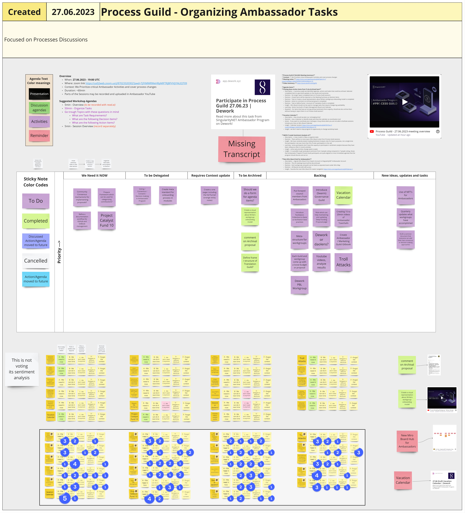

# Week 26



## Monday 26th June 2023

### Education Guild

## Tuesday 27th June 2023

### Ambassador Town Hall

### Process Guild

#### **Context:**&#x20;

We Prioritize critical Ambassador Activities and cover process changes

#### **Meeting notes:**

[https://miro.com/app/board/uXjVM7pbrUY=/?moveToWidget=3458764558152903220\&cot=10](https://miro.com/app/board/uXjVM7pbrUY=/?moveToWidget=3458764558152903220\&cot=10)&#x20;

<figure><figcaption>
Image of Miro board for this meeting
</figcaption></figure>


hi-res PDF of Miro board for this meeting


#### **Video Summary:**



#### **Agenda Items**&#x20;

**1) Closing down Action items from "To be Archived" lane**&#x20;

**Description** - in previous week we identified Agendas, actions and tasks that could be archived. Selected completed items to give brief updates on the results and outcomes \
**Decision -** No longer report completed items in Process Guild sessions\
**Decision -** Closed Items will be reported on the Meeting Summary as Decision Items \
**Decision -** Task to create a visual representation about Writers Workgroup onboarding model is completed \
**Decision -** Action to comment on Archival proposal is completed \
**Decision -** Task to Define frame / structure of Translation Guild is completed \
**Insight -** Miro Board should not be used to manage tasks that require change log auditability \
**Learning -** Notion has built in Project Management board and calendar\
**Question -** For items that have an strong archival sentiment from majority, should we also archive them without having to report them in on Process Guild session?&#x20;

#### **2) Vacation calendar**&#x20;

**Description -** How should we plan our recharging time? \
**Decision -** Use a calendar to identify breaks, and treat the calendar as a coordination tool \
**Action -** If you want to coordinate your recharge or busy times when you are not able to facilitate sessions, include your time on Miro Board calendar\
**Insight -** Calendar location [https://miro.com/app/board/uXjVM7ZVTSo=/?moveToWidget=3458764558094746024\&cot=10](https://miro.com/app/board/uXjVM7ZVTSo=/?moveToWidget=3458764558094746024\&cot=10) \
**Insight -** we don't need to stop program its opportunity to change workshop leads&#x20;

#### **3) ABCD+F model Sentiment Analysis v2**&#x20;

**Description -** A new model to help us organize tasks \
**Decision -** There will be no more async Miro Board votes from Process Guild sessions \
**Insight -** We have randomly tested creating sentiment analysis votes for async purposes; the participation rate has never been more than 5% of voter participation in the call. \
**Learning -** some participants don't have the capacity to participate in sentiment analysis because they have been voting too often in recent activities.\
**Insight -** some task priorities change week to week. \
**Insight -** it is possible to get quite good sentiment from 3 people voting compared to 7 people voting, shows that Ambassador Program Process Guild participants are quite aligned on most immediate agendas that the program should discuss and act on&#x20;

#### **4) New Miro Board Hub for Ambassadors**&#x20;

**Description -** migrate Miro Board from Swarm Account to SingularityNET Ambassador Account \
**Decision -** The All Meetings board will be discontinued \
**Decision -** Each workgroup and guild can be listed as separate board under Miro Map \
**Decision -** All Boards are with edit access \
**Insight -** Favorite the main Miro Board for easier navigation [https://miro.com/app/board/uXjVM7pbrwc=/](https://miro.com/app/board/uXjVM7pbrwc=/)

##

## Wednesday 28th June 2023

### Dework PBL Workgroup

### Process Modelling Workgroup

### Incubation Workgroup and Strategy Guild

#### Host(s):&#x20;

Cran, Headelf&#x20;

#### Attendees:&#x20;

cran, sucrenspice, rojo, peter, headelf, tevo, felix, eszter&#x20;

#### Length of Meeting:&#x20;

2 hrs

#### Agenda Items:&#x20;

#### 1) Go over the Simplified Q3 Budget and WG Lead Doc&#x20;

**Goal and/or Action Items:** Continue discussion on Q3 Budget 30min prior to next Treasury Guild meeting on 29th June.\
**Brief Summary:** We started the meeting with headelf providing an overview on last week's discussion which included the overview of the Simplified Q3 Budget [https://docs.google.com/document/d/1mWpC6dKJffAq-q4d\_dtOEtKY60b\_5AiDPkUricsAT\_A/edit?pli=1#heading=h.chpwdzvdx69m](https://docs.google.com/document/d/1mWpC6dKJffAq-q4d\_dtOEtKY60b\_5AiDPkUricsAT\_A/edit?pli=1#heading=h.chpwdzvdx69m) \
\
DeWork Template for Fund Requests: [https://app.dework.xyz/singularitynet-ambas/treasury-guild-87240?taskId=1e4016db-0f99-4f03-ba23-8a70ac4e8483](https://app.dework.xyz/singularitynet-ambas/treasury-guild-87240?taskId=1e4016db-0f99-4f03-ba23-8a70ac4e8483) \
\
We outlined Pros, Cons, Thoughts & Ideas via Miro (see images below)

<figure><figcaption></figcaption></figure>

 

<figure><figcaption></figcaption></figure>

 

<figure><figcaption>
Images from this meeting's Miro board
</figcaption></figure>

Discussion highlights included what the malleability of a Fund Request could be and how proposals fit into this outline. Seemed to be an agreeance that the simplified budget made sense although not everything is fully hashed out quite yet.&#x20;

**WG Leads Draft:** [https://docs.google.com/document/d/1DZK75HYvGKdhdj7TwO1EfPXrSwKfY7VVreeECToDh78/edit#heading=h.qh9qlksztg9p](https://docs.google.com/document/d/1DZK75HYvGKdhdj7TwO1EfPXrSwKfY7VVreeECToDh78/edit#heading=h.qh9qlksztg9p) "The outlined text is not theoretical, rather looking back and simply identifies and formulates already existing knowledge, work and responsibilities which emerged though the previous months…. So, this document is more of an observation than a proposal as it does not introduce anything new to already observable items !"&#x20;

The Draft outlines what a WG/Guild Lead is, Observable Responsibilities, and How to become a Lead. Some conversation also happened around introducing Rejuve into the program.

## Thursday 29th June 2023

### Onboarding Workgroup

#### HOST(S):&#x20;

SucrenSpice&#x20;

#### ATTENDEES:&#x20;

SucrenSpice, Peter, Headelf, Vani&#x20;

#### LENGTH OF MEETING:&#x20;

1HR&#x20;

#### AGENDA ITEMS:

#### 1) Process flow for Onboarding&#x20;

see [https://miro.com/welcomeonboard/d0JrMERkRzYyUEVReFlqQ2x0cEtxRGpIM0hLNjNSU3A5Q1VQMHVSenRwUlRaN2hHZWlXWFRBWldJNWE2OFpjNXwzNDU4NzY0NTQzMDc1MTU0ODE1fDI=?share\_link\_id=516527842800](https://miro.com/welcomeonboard/d0JrMERkRzYyUEVReFlqQ2x0cEtxRGpIM0hLNjNSU3A5Q1VQMHVSenRwUlRaN2hHZWlXWFRBWldJNWE2OFpjNXwzNDU4NzY0NTQzMDc1MTU0ODE1fDI=?share\_link\_id=516527842800)

#### 2) Channel for new members in the program(Great Filter)

#### 3) Interview / Quiz for new members

#### GOAL AND OR ACTION ITEMS

1. The process flow for onboarding was analyzed and we came to a conclusion that the introductions channel might not be needed if new applicants to the program were directed to the sign-up form in the getting started channel. This channel should contain all a new member needs to know to get started and contribute to the program.
2. A discord channel for new members is not necessary. New members are to be directed to join the guild or workgroup they have interest in. The workgroup lead is responsible for welcoming the member into the group and conducting an interview/test or assigning a task if it is a requirement to be a member of the workgroup.
3. Information about the various workgroups and updates on what they are currently working in should be pinned in the respective channels. This would help new members have a sense of direction.
4. Vani and SucrenSpice would work together to update the onboarding process in the Gitbook.

### Treasury Guild

### Stake Pool Workgroup

### DeepFunding Town Hall

#### Host(s):&#x20;

Rojo, Felix, Cran&#x20;

#### &#x20;Attendees:&#x20;

Jan Horlings, Rafael Presa, Peter Elfink, Curtis Myers (DCypher), Kenric Nelson & William Thistleton (Photrek), Ubio Obu (Facilitators Collective), Tommy Frey (SNET Ambassador), Guillermo.

#### Video recording: (see [https://www.youtube.com/@deepfunding](https://www.youtube.com/@deepfunding))



#### At this DeepFunding Town Hall, we had:&#x20;

#### 1) Updates from DeepFunding Team

* announcement of DeepFunding round 3 in 2 weeks from now
* announcement of new engagements at DeepFunding through different review activities:

> * Proposal Review by previously awarded proposers
> * Proposal Eligibility review by DeepFunding Community
> * Awarded Proposer Milestone review by DeepFunding Community

#### 2) General discussion about potential benefits of cross innovation fund collaborations&#x20;

where present participants seem pretty aligned that such initiatives would be indeed helpful and could bring strong benefits.

#### 3) End of Round 2

This was the last DeepFunding Town Hall funded by DeepFunding at Round 2. Wrapping up the proposal now and preparing a close out report.

#### Length of Meeting:&#x20;

2.5 hrs&#x20;

## Friday 30th June 2023

### Video Workgroup

#### Attendees:&#x20;

Rojo, Lilycupcake, Agus, Sucren

#### In this meeting we:&#x20;

* Discussed workgroup progress (projects, social media,…)&#x20;
* Discussed Agus’ work on social media management&#x20;
* Discussed Lily’s progress on the onboarding video and decided to put it up for a vote by tomorrow morning.

### Writers' Workgroup

